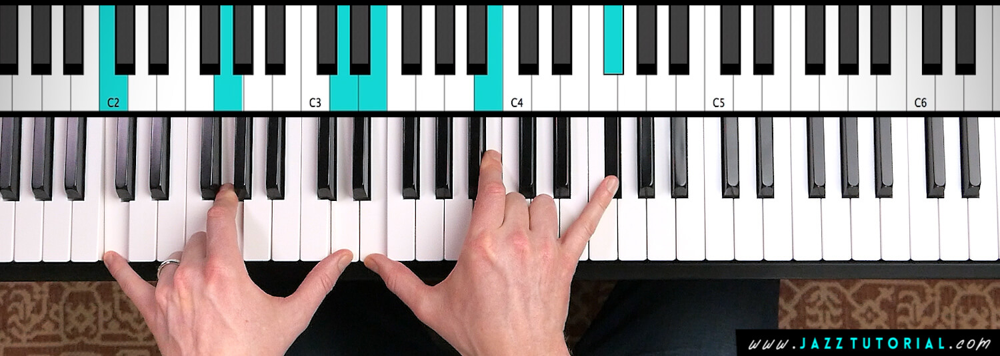

# january '26
TODO | X min

---

### 1. the real harmonic minor

a few months ago I talked about harmonic minor in one of these. I made the claim that harmonic minor was exactly the same as natural minor except that the fifth was turned major. 

that's not true. although I do see now where the confusion came from. songs in minor are usually written entirely in natural minor, with the exception of the V being borrowed from the harmonic minor. 

here's what harmonic minor actually looks like:

### 2. russian llm gigachat

I was watching russian TV with my russian parents and an ad for a russian LLM came up. it's called gigachat. I had never heard of it before, but I think the name is hilarious. well, only if it was named that unintentionally. if it was intentional then I think it's a bit less funny.

I've never actually tried it and tbh I don't plan to but now I know it's out there.

### 3. portuguese guitar + fado 

I was looking for things to do in Portugal and fado came up. it's a traditional portuguese style of music featuring spanish guitar, portuguese guitar, and a singer. for some reason whenever it's brought up, people mention that "women cry" when they listen to it. which sounds a bit strange, but I had to admit I was curious. 

so I made some reservations at what seemed to be a nice fado spot in Lisbon. 8 pm reservations which, by my parents standards, is a very late dinner. by mine too, I guess. but it was worth it. the food was probably the best I had while I was with them and the music was great. I was sitting directly to the left of the portuguese guitarist. which was really fun because I could see exactly how he played the instrument. he used two finger picks, one on his index and one on his thumb.

unfortunately I did not cry

### 4. mowscow + lengingrad during the ussr...

...had identical city layouts. according to my dad and a classic soviet union holiday movie called "The Irony of Fate, or Enjoy Your Bath!" my parents showed it to me for the first time this past New Year's. actually a good movie I really enjoyed, but more so than the movie itself I just enjoyed seeing my parents so happy. the nostalgia was insane because so much of what was featured in the movie they had experienced growing up. the same tv, the same apartment decor, the same spoons. literally the same spoons, my dad was very excited about it. 

anyways the premise of the movie is that a guy gets super drunk and flies home to the wrong city (leningrad instead of moscow). he didn't realize until he got back to his apartment and was greeted by someone else claiming to live there. at the time (I assume not anymore), leningrad and moscow had many of the same street names so theoretically you could go to the same address in both cities and if you're super drunk you might not even realize.

I have not looked into it that much so I'm not sure to what extent this is actually true, but it is a great premise for a movie.

### 5. viking berkserkers used henbane

poisonous in large quantities, hallucinogenic in small. also apparently causes rage, making it suitable for berkserkers. I feel like I should know more about vikings considering my name, but I really don't know much about them at all. honestly I can't even really name when their time period. I think it must have been like 1000-1500? somewhere in that range. 

jk I was off by about 500 years. 793-1066. good to know!

### 6. logic pro vocal chain

I wouldn't consider myself a naturally good singer, which is a bit problematic considering some of my goals. luckily logic pro has a ton of features built in that make vocals sound better. I'm not even close to familiar with all of them, but here's a solid list after messing around with it for a bit:

1. DeEsser 2 (removes excessive S/air sounds)
2. Loudness (keeps volume consistent)
3. Pitch Correction (subtle tweaks to pitch)
4. Channel EQ (cutting out + boosting certain frequencies)
5. Compressor (reduce peaks + control volume)
6. Compressor (again, tbh I'm not sure why that's just what the guide I was following recommended lolz)
7. Delay (creates an echo effect, great for a stylized vocal)
8. ChromaVerb (reverb, gives a nice singing in the shower effect)

I remember when I first attempted to record vocals it physically hurt me it sounded so bad. I didn't even touch my mic again for at least 6 months. so it feels good to be able to create something that sounds even moderately listenable. 

I still definitely need to work on my performance a bit I think, but this definitely helps.

### 7. chord voicing above all

I think I had heard people say this, but I didn't fully understand it until I had to apply it. basically a chord voicing is how you arrange the notes of a chord. for example, a C major chord can be voiced as a basic triad with C in the root or as an inverted triad with E in the root.

it's super important to mess around with these voicings to create progressions that feel more step wise instead of bouncing around all over the place (unless I guess that's what you're going for). what I mean by that is you want a note from one progression to lead nicely into a note of the next.

doing this makes it a LOT easier to include chords outside of the key and ensure they sound good. a lot of the time when you can't figure out why a chord progression works the answer is just a well designed voicing.

### 8. kenny barron m11

a chord voicing that looks like this...

... and sounds very nice.

learning this voicing for some reason also made it click for me that you can just build any chord you want without really thinking about it w/ intervals of 4ths and 5ths and some disonant intervals thrown in here and there and it'll usually sound pretty nice. 

### 9. no elements have the letter j or q in them

which personally I think is a missed opportunity 

### 10. the days that never happened

in october 1582, the roman catholic world officially moved from the old Julian calendar towards the modern Gregorian calendar (in order to make leap days more precisely aligned with the actual movement of the Earth around the sun). in order to account for the build up of misalignment over many, many years on the julian calendar, it was decided that the day immediately following october 4th became october 15th. so if anyone ever tells you something happened on october 5th-14th 1582, you know they're wrong!

### 11. ocarina time melodies - 5 non pentatonic notes

all the songs you can learn on the ocarina consist of only 5 notes (in order to make them easier to play on an n64 controller). interestingly, composer koji kondo didn't go with the obvious choice of the pentatonic scale. instead, he chose d, f, a, b, and d (up the octave). so basically the notes of a dm6 chord. turns out these give notes are super versatile and you can build a lot of interesting, distinct sounding melodies with them (unlike the pentatonic scale).

### 12. the country with the highest percentage of citizens who give to charity is myanmar

good for myanmar. they sit at around 90% participation vs the us's 70ish. I'm curious what myanmar does differently that causes them to donate more.

### 13. msg came from seaweed initially

developed by a japanese chemist in 1908. today we mostly get it from corn and sugarcane. neat

### 14. free orchestral sample libraries (and the not free ones)

you've probably heard of samples in music. it's basically just a little audio clip that you take from another place and put in your music. I didn't realize that a lot of the strings you hear in music (especially lower budget stuff) comes from sample libraries. these are libraries that have recorded thousands of sounds from musicians player every note, with every articulation, with every intensity, and every instrument found in an orchestra. you can then take these sounds and control them using a midi keyboard. the professional ones cost thousands of dollars, but luckily for me there are free ones out there. they don't sound as good as a real orchestra (to my ear), but part of that is likely just me not knowing how to program them to sound more realistic.

anyways I am grateful that this exists because otherwise I would have a hard time making the music I want to make.

### 15. the median wealth in the us is much lower than the average wealth

for obvious reasons. here's a helpful [infographic](https://www.visualcapitalist.com/ranked-top-20-countries-by-average-vs-median-wealth/#google_vignette) showing how we compare to other countries yeehaw 

### 16. 36% of calories produced by crops is fed to livestock

12% of which comes back as animal products... not a great return on investment.

### 17. identifiable victim effect

studies show that people tend to sacrifice more to save a single identifiable person rather than some generalized statistic (e.g. 4 million people). which makes sense. we can empathize with a person. a statistic feels cold and abstract. 

it is a bit unfortunate for those 4 million people in need though. 

### 18. robert e lee married george washington's great granddaughter 

except washington never had any biological kids so it's like his adopted great granddaughter but anyways

I'm putting this on hold to focus on other creative pursuits lolz but it's fun and I will continue to update my calendar it's starting to feel like homework and that's not good

---

(1) *yo*