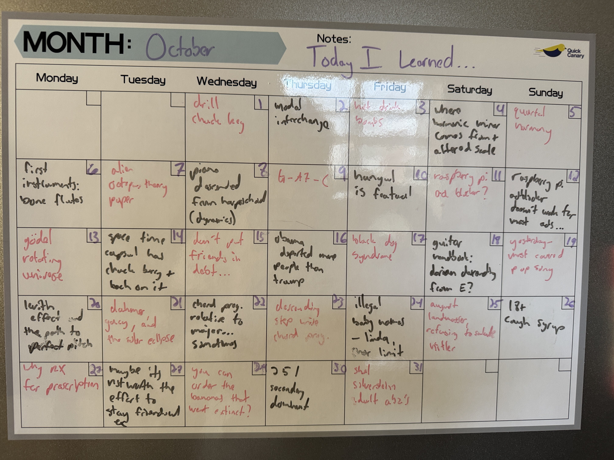
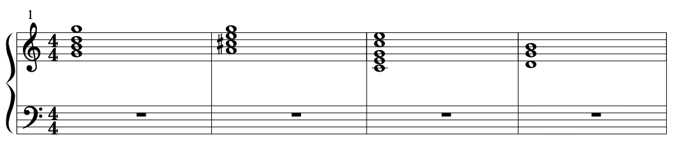

# october '25
against all odds, under any circumstances | 15 min

---

hooray for another month of learning woohoo yeehaw happy thanksgiving did you know thanksgiving was invented by sarah hale and made into a national holiday by abraham lincoln in 1863 to improve relations with the south AND was only the third ever national holiday in the US 👊

I've also just learned that FDR briefly tried to move Thanksgiving up a week when he was president to "aid retail business by producing a longer Christmas shopping season" according to congress.gov and this is probably my new least favorite FDR fact of all time. 

## today I learned: october edition

this is now the fourth month I've been doing this and I am honestly shocked that I haven't had any off days yet. 

I do have to come clean about one thing though: I keep a bank of things I've learned on my notes app and pull them out whenever it's convenient. so sometimes when I say I've learned something on the 7th, in reality I actually learned it a few days earlier. hopefully you can forgive me. I feel that the spirit of the project is still intact so I don't feel super guilty about it and honestly I wasn't even planning on telling you so just be grateful that I did. 

### 1. use a "chuck key" to open/close drill teeth

if you've ever used a drill you know that it has teeth that open and close on drill bits. to this point, I thought you could just spin the drill head a certain way and that would open the teeth and that's what I always did. but then one day (while I was putting together my bookshelf), this method stopped working. I really didn't want to buy a new drill, so I looked into it and I stumbled upon the chuck key. do people know about the chuck key? is this common knowledge. I didn't. anyways yeah you're supposed to use the chuck key to tighten and loosen the teeth 👍

### 2. modal interchange

this wasn't the first time I had ever heard the term. back when I was paying way too much for guitar lessons in westwood, my teacher told me it was when you mixed chords from major and minor keys but I didn't have any of the context necessary to really understand what was going on. 

I think I talked about modes in my last post but basically it's when you take a scale and start it on a different note. this creates a different sequence of whole and half steps around your new tonal center throughout the scale and in turn makes it sound different. for example, A minor is just the 6th mode of C major. it has all the same notes, just starting on A.

anyways, modal interchange is when you borrow chords from related keys and include them in a chord progression. for example, if your progression is in Cmajor you can borrow from Cminor (the parallel minor). you can do the same for other modes. there's probably more here for me to learn this is quite a big topic, but that's the idea of it. 

### 3. hot drink bombs are a thing

you've heard of bath bombs, but do you know about hot drink bombs. I stumbled upon them while I was buying Halloween candy (which btw was exclusively eaten by me because not a single kid came to my apartment lol) and I find the idea very interesting but I feel like there is a very good chance after I do it once I'll never want to do it again. I think if I ever go skiing again I'll bring one because there is nothing better than hot chocolate after skiing and adding a bath bomb on top of that would be so fun.

### 4. where harmonic minor + altered scale come from

like I mentioned natural minor is just a mode of the major scale. let's take C major as an example.1

<table>
  <tr>
    <th>I</th>
    <th>ii</th>
    <th>iii</th>
    <th>IV</th>
    <th>V7</th>
    <th>vi</th>
    <th>vii°</th>
  </tr>
  <tr>
    <td>C</td>
    <td>Dm</td>
    <td>Em</td>
    <td>F</td>
    <td>G7</td>
    <td>Am</td>
    <td>Bdim</td>
  </tr>
</table>

you can see that the 6th chord is Am. if we instead use that as our tonal center (e.g. the i chord), we get the key of A minor.2

<table>
  <tr>
    <th>i</th>
    <th>ii°</th>
    <th>bIII</th>
    <th>iv</th>
    <th>v</th>
    <th>bVI</th>
    <th>bVII7</th>
  </tr>
  <tr>
    <td>Am</td>
    <td>Bdim</td>
    <td>C</td>
    <td>Dm</td>
    <td>Em</td>
    <td>F</td>
    <td>G7</td>
  </tr>
</table>

so we just get the same chords, except starting on A minor. one kind of weird thing is that now the five chord is a minor chord, Em. ideally, the five chord would be a dominant chord (e.g. E7) so that we get a stronger resolution from the five to the one. this is where harmonic minor comes from! people just decided it sounded better and so it became a thing.

<table>
  <tr>
    <th>i</th>
    <th>ii°</th>
    <th>bIII</th>
    <th>iv</th>
    <th>V7</th>
    <th>bVI</th>
    <th>bVII</th>
  </tr>
  <tr>
    <td>Am</td>
    <td>Bdim</td>
    <td>C</td>
    <td>Dm</td>
    <td>E7</td>
    <td>F</td>
    <td>G7</td>
  </tr>
</table>

for similar reasons, people created the melodic minor scale. the melodic minor is mostly the same as a major scale, except for a flat third. if you've heard of the altered scale (which people use a lot in jazz), it's just the 7th mode of the melodic minor. very cool.

### 5. quartal harmony exists

to be honest, I still don't know much about this. but it is interesting. for context, it's important to understand that most popular harmony uses stacked third intervals. for example, take a C major chord. C major consists of the notes C, E, and G. C and E are a major third apart. E and G are a minor third apart. if we wanted to we could add a major 7th on top and that would be a major third from the fifth. the specifics here don't really matter what matters is that you understand that chords are built by stacking thirds. usually. 

there's no rule book saying we have to do it that way. that's just what people tried and they liked. you could also build chords using fourths. that's what quartal harmony is. you can probably guess what quintal harmony is. 

I had never heard of the terms for these, but I realized I recognized the sound of them. lots of songs use them. if you have a piano handy you should give it a shot there's a very good chance you've heard it before. 

what I don't really know is how to use them in the context of a real song but I'll get there someday. 

### 6. the first instruments were bone flutes

at least the first instruments that we have evidence of. a stringed instrument would probably be harder to preserve, if I had to guess. lots of music stuff the past few days here.

### 7. alien octopus paper

I'm going to be so honest I don't really remember why I wrote this but I think basically I learned there was a research paper, like a real peer reviewed research paper, that explored the idea that maybe octopuses are actually descended from aliens. basically their (and by they I mean all cephalopods) genome is so different that it's very difficult to figure out how it might have evolved from other life here on earth. 

to be honest I haven't read the paper, maybe they make a better point than that. but like, come on. it feels like a bit of a jump to say "oh we can't figure out how these things evolved so they must be aliens." that would be fun, though.

### 8. piano descended from harpsichord

yeah I mean it makes sense. a harpsichord is just a more primitive piano that plucks the strings whenever you press the key. in this way it's a bit more limited because you can't control the dynamics. a harder key press will result in the same volume as a softer press. to get around this issue, a guy named Bartolomeo Cristofori fitted a keyboard with hammers that struck the strings harder upon a harder key press. and the piano was born.

I find the evolution of instruments super interesting and I wish I could find a family tree of all the instruments ever made. 

this is the closest I was able to find, although obviously not everything is represented. pretty cool, though! 

### 9. mystery chord progression

for this one, I just wrote G-A7-C on my calendar and to be honest I had no idea what that meant at first. then I played it on my guitar and was like hm this sounds kinda nice. and then I looked at the chords and I was like hm A7 doesn't make any sense in this chord progression what is going on here... and then I remembered. A7 comes from G mixolydian... this is modal interchange!

it's time like these when I am so happy I decided to do this project because I feel so proud of myself for figuring that out.

<blockquote>
<em>looking back at this a month later, my explanation isn't right. A7 doesn't come from G mixolydian (and tbh I have no idea why I thought it did), so this isn't really a case of modal interchange. being wrong is part of learning so I'm not going to remove this, but it is a good opportunity to look into it again! what I've realized is that this is more of a case of chromatic voice leading. you can see below that there's a voice that take chromatic steps down with each chord. the D in the G major leads to the C# (the note outside the key) of A7 which leads to the C of C major and then lands on the B of G. this creates a cool dissonance during the A7 that sounds really nice, despite not really making sense in the context of functional harmony. more interesting is that the C# is actually the tritone in the context of G major, aka the most dissonant note above the tonic. but it works here! the lesson here is that voice leading trumps functional harmony every time.<em>
</blockquote>
> 

### 10. hangul is a featural script

Hangul is the script used for Korean. it's phonetic, meaning each character represents a sound (unlike something like Mandarin where each character represents a word). 

what's especially cool about Hangul is that it's featural -- each character's shape is meant to show things like the place of articulation or the voicing of the sound produced. for English, this would be like if the letter p looked like a pair of lips or something, since that's where the p sound is articulated. in Hangul, it does! (ㅂ)

### 11. you can make a network wide adblocker with a raspberry pi...

it's called pi hole. the way it works is that it blocks any data from certain domains that are known to be sources of ads. that is so cool

### 12. ...except it doesn't work for most websites

unfortunately it's a bit limited. sometimes websites serve ads from the same domain as the content you actually want to see. actually this is most modern websites: youtube, netflix, hulu, etc. so it won't work for them. but still pretty cool.

### 15. don't put friends in debt

yeah... it just puts unnecessary strain on the relationship. usually I'm pretty chill when it comes to money. I strongly prefer a relationship where "I can take this one and you'll get the next one." it just feels less transactional. although I recognize that only works if you're decently close. anyways. 

I had a friend subletting from me for the summer. she also happened to be my ex, but that's besides the point. unfortunately unbeknownst to me her family was going through a bit of a slump and she wasn't able to pay me back on time. that was fine with me. I tried to make it clear that she could take as long as she needed. at the same time I was also trying to give gentle reminders about it just to make sure we were on the same page. 

looking back it was a horrible mistake to put her in that situation and I will probably never do it again. being a debt collector is miserable. losing friends is also not great. learn from my mistakes 👍

### 16. obama deported more people than trump

a LOT more. I had no idea. honestly it's kind of embarrassing for trump considering he is mr deportation. it's mostly just sad though. looking into it a bit more, there's some justification saying the reason Obama's numbers are so high is because the way deportations were counted were changed and because there were just more people crossing the border.

in reality, Trump's policies were still quite a bit stricter since he removed Obama's prioritization of recent entrants and those with criminal records.

I guess that makes sense. still a bit sad though. 

### 17. black dog syndrome

I've been fostering a black dog for the past few months. she just gave someone a black eye. long story. anyways unrelated but I was told by the shelter that black dogs historically take longer to get adopted. probably because of superstition or something. I had assumed that was the case for cats but I didn't know it was true for dogs too. 

### 19. yesterday is the most covered pop song of all time

it's a great song so it makes sense. there's an elvis cover, a frank sinatra cover, and a marvin gaye cover. many more. 

### 20. the levitin effect and the path to (pseudo) perfect pitch

in short, the levitin effect describes the observation that most people remember what key a song is played in. when they sing it, it's usually in the original key (or close to it). 

if this is true, there's nothing stopping anyone from being able to sing any note they want on command. all you have to do is train yourself in relative pitch and then use a song you know well as a reference.

I use the song Alexander, which starts on an A. ideally, I would use a song that starts on a C. I should mention this only works if the song isn't commonly transposed into other keys. so something like Happy Birthday wouldn't work. 

anyways this isn't really perfect pitch because it will take you a second to get to a certain note since you have to think about it but for those of us who didn't have parents who forced them to do ear training from a young age this will have to do.

### 21. dahmer, gacey, and the solar eclipse

I'm someone who wants to believe everyone has some good in them. naturally, whenever someone learns this they ask, but what about serial killers? or what about hitler? or any other person who is historically known to have done some bad. 

in hopes of getting a better answer to that I looked into jeffrey dahmer a bit. and by "looked into" I mean I watched the Netflix show about him. unsurprisingly, he has a ton of childhood trauma that led to his actions. I mean assuming the Netflix show is accurate. anyways. 

there was one detail from that show that stuck out to me which was that when Dahmer was in prison he decided to get baptized. out of pure coincidence the day he chose just happened to be the day of a solar eclipse AND the day John Wayne Gacey (another serial killer) was killed. 

a coincidence is a coincidence but as far as they go that is one of the crazier ones.

### 22. chord progressions are written relative to the major key... sometimes

you've heard of chord progressions. I've talked about them a few times in this post alone. often, chord progressions are written in terms of roman numerals instead of exact notes in order to make them applicable across keys. for example, a common chord progression is I-V-vi-IV. you may recognize it from Don't Stop Believing from Journey or Let it Be by the Beatles. an uppercase roman numeral indicates a major chord and a lowercase numeral is a minor chord. the numeral itself indicates the degree of the scale to build your chord from.

the Roman numerals communicate the same information for any key. we could play I-V-vi-IV in C in which case we'd use the chords C, G, Am, F. or we could do it in G (G, D, Em, C). that's all fine. 

unfortunately this system starts to become a bit of a mess when you start working in minor keys. or anything that's not exclusively major.

because of the fact that a minor and a major scale consist of different scale intervals, people have developed different conventions for the numerals. some people just use the same numerals whether you're in a major or minor key. I feel like that's a bit confusing. especially as you start to get into more non-diatonic music (e.g. music containing chords outside the key).

instead what people do is they write their progressions relative to major. for example, the third chord of a minor scale would be bIII, indicating its a half step below the major third and that it's a major chord. you can see more examples of this on day 4.

anyways this was a huge source of confusion for me for a while and I'm glad I have finally cleared it up.

### 24. illegal baby names

it's illegal to name your baby Linda in Saudi Arabia. I have no idea why. I looked into this because I was wondering what the criteria for a name is in the US. like what's the character limit? there must be.3

anyways yeah that's how I learned the name Linda was illegal in Saudi Arabia.

### 25. the man who didn't salute hitler

August Landmesser. 

famous for not saluting Hitler in this photo.

it's so difficult to stay true to yourself when everyone else disagrees. it's even harder to do it and be on the right side of history. everyone should aspire to be like August Landmesser.

### 26. some cough syrup is 18+

normally when I get sick I just power through it. I must be getting old or something though because the longer I waited the worse this cold was getting. 

I finally gave in and drove to CVS to pick up some cough syrup. I was checking out and the cashier asked me for my ID. he explained that the cough syrup I was buying had an ingredient that could be misused in high quantities. looking into it later I learned it was a hallucinogen. crazy town.

I also learned that in my old age I kind of enjoy the taste of cough syrup.

### 27. why RX for prescriptions

it doesn't seem like the best abbreviation. in short, it comes from the latin for recipe. I don't understand why we use an abbreviation that comes from Latin but what're you gonna do. 

### 29. you can order the bananas that went extinct

I think I talked about them in my last post. apparently you can order them online. they're very expensive. hank green says they're just ok.

ok that's enough for this month wow woohoo another successful month of learning here's to many more 

---

(1) *to make it a little cleaner visually, I'm just showing the triads (besides the dominant chords), but you can imagine also adding the 7s to each chord.*

(2) *as a quick note, for my roman numeral notation I'm writing everything relative to the major key. since A minor has a flat third (compared to A major), I'm writing the third of A minor as bIII. this was a huge point of confusion for me because there are multiple conventions here. I think it comes up later in the month. I like this one so I will stick to it.*

(3) *there is, but it varies by state. some don't have any limits (e.g. Colorado or Illinois). Others limit to a total of 100 characters (Texas). I could keep going. anyways lesson learned: if you want to name your child a super long name go to Colorado or Illinois.*