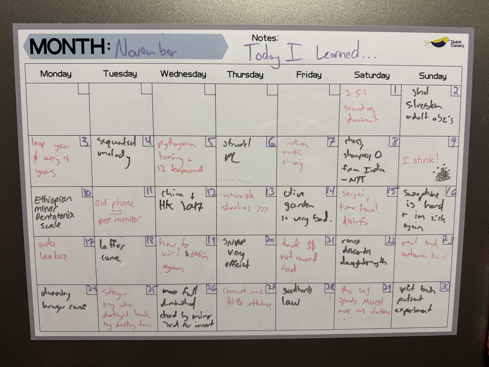

# on learning 11/25
and a few goals for the new year | 12/13/2025 | 12 min

---

I am very much not a planner. I've always been this way. I hate sticking to a schedule. actually no, I don't hate it, I'm just terrible at it. 

unfortunately for me, I have a lot I want to get done next year. and if I intend on even getting close, then I need to start planning. so it's decided. 2026 will be the year I become a planner.

I should also mention I think New Year's resolutions are dumb so this is definitely not that. I started doing this a few days ago. two days ago. basically every night before I go to sleep I set aside some time to think about the things that I want to accomplish the next day. and then I literally go and block it out in my calendar. surprisingly to this point, I've been able to stick to my schedule pretty well. to be fair, it's only been two days. but overall I am enjoying it and I think I might actually stick to it.1

I've also been scrolling DRAMATICALLY less than I used to. it's always an ongoing battle for me and there are ups and downs. this is probably moreso related to the fact that I deleted the YouTube and Instagram apps but anyways. I don't want this to turn into productivity slop, so I'm gonna stop that discussion there.

ANYWAYS. here are the things I learned in November.

## today I learned: november edition

### 1. ii V I secondary dominant

I know what you're thinking... oh god another boring fricking music theory day. what a nerd.2 well I think it's cool and fun so listen up.

a decently common technique in harmony is called the secondary dominant. it's built off of the idea that all chord progressions (and music in general I guess) function off of the build up and release of tension. one of the most tense chords in a key is the dominant V chord. when you hear it, your ear wants it to be resolved to the I. turns out you can use this same idea to incorporate chords outside of the key in a systematic way. take the following chord progression:

  <strong>I vi IV V</strong>
  <audio controls src="../../assets/audio/til/I vi IV V.mp3" style="margin-top: 8px;">
    Your browser does not support the audio element.
  </audio>

pretty standard. you've heard it a million times. we can mix it up by inserting the dominant chord on top of the IV as follows.

  <strong>I vi V7/IV IV V</strong>
  <audio controls src="../../assets/audio/til/secondary_dom.mp3" style="margin-top: 8px;">
    Your browser does not support the audio element.
  </audio>

the /IV just indicates the V7 is in the key of the IV chord. this is called a secondary dominant! it's a pretty reliable tool for spicing up your chord progressions.

turns out it's pretty common practice in jazz harmony to take this technique a step further and add the ii chord in addition to the dominant V.3 here's an example.

  <strong>I vi ii/IV V7/IV IV V</strong> <!-- !TODO: add audio files -->
  <audio controls src="../../assets/audio/til/251 secondary_dom.mp3" style="margin-top: 8px;">
    Your browser does not support the audio element.
  </audio>

### 2. shel sivlerstein adult abz's

it exists.

whenever I think of shel silverstein all I can see is that one picture of him he put on the back cover of "Where the Sidwalk Ends" where he has his foot prominently displayed in the center of the frame. he's also quoted as loving "to have a good time." we love shel. I won't put a photo of it here but I'm sure you can find it.

### 3. leap years don't happen every 4 years

although we probably won't live to see the next time a year divisible by 4 is skipped. it happens at the top of every century (unless the year is divisble by 400), so the next time will be the year 2100. if I'm still alive by then I will be very surprised.

### 4. sequential melody

a sequential melody is a melody repeated over the same intervals of a chord, but starting on a different note. the song autumn leaves is a good example. we tend to like them because our brains love repetition that is disguised as something new.

### 5. pythagorean tuning + 12 tone equal temperament

when you're learning about music for the first time, you kind of take things for granted. which makes sense. you're learning a lot of new things. why complicate that? 

but that does obscure a lot of the decision making that went into constructing the foundations of contemporary western music. and there was a lot. 

for example, hum the major scale to yourself and then play this. 

  <audio controls src="../../assets/audio/til/D_major_12TET.mp3" style="margin-top: 8px;">
    Your browser does not support the audio element.
  </audio>

how did you know what it sounded like? were you born knowing? no, definitely not. you were taught. it's like a language. if you had never been exposed to western music, you never would have learned it. 

so we've established there's nothing about the major scale that is innate to us. so where does it come from then? why couldn't it have sounded more like this?5

  <audio controls src="../../assets/audio/til/D_major_just_intonation.mp3" style="margin-top: 8px;">
    Your browser does not support the audio element.
  </audio>

a lot of is thanks to a guy named pythagoras. you've probably heard of him. x = -b and all that.6 what pythagoras did was he noticed that if you pluck a string it produces a certain pitch AND, crucially, if you pluck a string 2/3 the length, it produces a pitch (called a perfect fifth) that resonates really well with the original pitch.

if you keep building upon that, you eventually get all the notes of the major scale. let's say the fundamental of the original string is C. starting from C, if we pluck at 2/3 the length, we'll get G. then D. then A and E. if we scale our octaves appropriately this gives us the notes of the pentatonic scale: C, D, E, G, A. pretty cool! from there we can pretty easily get the last two notes of the major scale through a similar process. 

unfortunately, pythagoras's system starts to fall apart once you try to play in other keys. things start to sound really dissonant and unlike modern music. in order to fix that problem, people developed many other tuning systems. I'm skipping over a major chunk of history, but what we've settled on today is called 12 tone equal temperament. 

basically, each half step is a ratio of 21/12 away. in effect, the tuning becomes a lot more versatile and we get music that sounds like what you're used to today. 

lots of decisions were made to get us to this point, and most people have never even heard about it!7

### 6. strudel programming language

I think this is so cool. basically it's a programming language for arranging music. if you're familiar with latex, strudl is to a garage band (or logic or whatever) as latex is to microsoft word. I'm not sure how practical it is, but it's pretty fun to mess around in. here's a little [thing](https://strudel.cc/#CgpzZXRjcG0oNjApCgokOiBuKCJbMCAyIDQgNSA2IDcgNiA1IDQgMl0vNSIpCi5zY2FsZSgiPEU6cGhyeWdpYW4%2BIikKLnNvdW5kKCJwaWFubyIpCi5nYWluKCJbLjI1IC41IC43NSAxIC43NSAuNSAuMjVdLzUiKQoubHBmKDI1MCkKCiQ6IG5vdGUoYDxbYzEgZTEgYzEgW2YxIGUxXV0KICAgICAgICAgIFtjMSBlMSBjMSBbZjEgZTFdXQogICAgICAgICAgW2MxIGUxIGMxIFtmMSBnMV1dPi8yMGApCi5zb3VuZCgiZ21fc3ludGhfYmFzc18xIikKLmxwZigyMDApCgoKLy8gJDogbm90ZSgiPGMxIGUxIGMxIFtmMSBnMV0%2BIikKLy8gLnNvdW5kKCJnbV9zeW50aF9iYXNzXzEiKQovLyAubHBmKDIwMCkKCgo%3D) I threw together as I was learning how to use it.4

### 7. beyond western music theory

what I learned on day 5 tells us a lot of the things we take for granted in western music is pretty arbitrary. that's why I'm so curious about the choices other cultures make. classical indian music theory is especially rich and super interesting. I had a conversation with a friend about it during a road trip and I've also watched a few videos, but still hoping to learn more about it. and other systems as well. I'm hoping to find a concept that isn't easily translatable into western theory, but not sure if that even exists. anyways all of this is super cool and I like learning about it 👍

### 8. chess, shampoo, and 0 come from India

according to the New York Times mini crossword from 11/8

### 9. I stink

my sister was visiting and vandalized my white board 

### 10. ethiopian minor pentatonic scale

I will be so honest I have not retained much of this but it stems from [this video](https://www.youtube.com/watch?v=x-_R9sycN7w) which explores ethiopian music theory and the history of ethiojazz. 

### 11. you can use an old phone as a pet monitor

I was looking into buying a pet monitor for my foster dog and very quickly realized they were super expensive. luckily, I had my old android phone lying around and I was able to figure out how to use that as a monitor. there's an app AlfredCamera (amongst many more I'm sure) that you can download on both your current phone and your old phone. once you pair them together, your old phone essentially live streams 24/7 to your new phone. very handy and you can even talk to your pet through the voice function. I'm sure there's a privacy concern somewhere in there given that the app is free but tbh I don't really care that much.

### 12. hong kong is set to lose autonomy in 2047

oh boy

### 13. minnesota has the longest shoreline of any state

which is surprising until you remember minnesota is also known as the land of 10000 lakes

### 14. olive garden is very bad

I hadn't had it in like 10 years. I mean I knew it wasn't good, but I didn't expect just how horrible it could get. granted it might be because my sister and I tried to game the unlimited soups and salads and breadsticks. our goal was just to try every single soup and every single dipping sauce flavor. by the fifth soup and third bowl of salad everything developed a certain quality that I can only describe as vomit-like. 

don't go to olive garden.

### 15. sergei ponomarenko, time travel, and disinformation

in 2006, a 30 year old man named sergei was arrested by the police in ukraine. he was wearing old fashioned clothes, had an old soviet ID, and claimed to be have been born in 1932. he also had an old camera with film on it that, when developed, showed a photo of a UFO and the Kiev skyline from 40 years ago. was sergei abducted by aliens and thrown into the future????

no. it was a hoax originating from a show called "Aliens." although the story is pretty fun and cool. but yeah disinformation is a powerful thing 👍

### 16. saxophone is hard and I'm sick

I bought a saxophone on facebook marketplace. picked it up from a guy at a gas station 50 miles away at 10 pm. he was very nice actually. 

I did my absolute best to clean the saxophone before playing it, but I still got sick after. very, very sick. I probably out for like a month. 

I had also never played any woodwind instruments before so there was a bit of a learning curve. I found it really hard initially to just get a note out. I still haven't started seriously learning by the way. but I can at least play a G scale now. so that's progress. 

anyways my instrument collection is looking better and better everyday. I really wish I had a better way to display them, but for now keeping them in their cases under my countertop will do.

### 17. ada lovelace's contributions to science

I had heard of her before, but I hadn't realized just how groundbreaking her work was. especially considering she lived just before Victorian England in the early 1800s. before there were any real computers, she wrote the first computer program.8 it was meant to run on a mechanical machine designed by Charles Babbage called the Analytical Engine. she also predicted computers would have operations far beyond just computation, which is a crazy thing to predict so many years before the first real computer is even built. shout out ada lovelace.

### 18. the laffer curve

it's a theoretical relationship between tax rate and tax revenue. the idea is if you tax more, you'll get more revenue. eventually though, the tax rate gets so high that revenue actually declines because it becomes prohibitively expensive to do any work (or people move).

it seems be accurate more or less. the main point of debate is where does the US fall on the curve. I would say we're in the green still, but what do I know.

this came up because I was looking into the claim that rich people and businesses would move out of New York if Zohran Mamdani was elected. I found that hard to believe, but I wanted to make sure that wasn't just my bias talking. it does seem like, now more than ever, people could easily move away from new york and accomplish the same things remotely if they really wanted to. the question is, do they really want to? what would zohran have to do to push them away? I can't say for sure. we'll see next year, I guess.

### 19. how to wind a bobbin (again)

there are certain things that I do semiregularly that I always have to look up before I do them. adjusting the truss rod on a guitar is one of them. tying a tie. another is how to wind a bobbin for a sewing machine.

I had to bust out the sewing machine because my foster dog Lenny ripped my brand new body pillow to shreds while I was away. it was my fault for leaving it alone with her.

but anyways I hadn't used the sewing machine in a while, so I needed a refresher.

### 20. SNAP is very efficient

at this point, the government shutdown had been going for three weeks or so, and it was getting a bit ugly. I think the Trump administration had just announced that SNAP food stamps wouldn't get funded,9 so people all across the US who depended on them would go hungry or be forced to find alternatives like food banks.

contrary to (what seems like) popular sentiment, a lot of government run programs are super efficient. SNAP is one of them. for every one meal that a food bank provides, SNAP can provide 9. that is an insane discrepancy. and it points to the power well run government programs. they're not all bad!

### 21. donate money not canned food

canned food drives are pretty popular, especially around thanksgiving. I guess there's nothing wrong with giving away cans that you've had sitting around for a while and don't intend to use. but you should definitely NOT go out and buy cans just to donate to a food drive. instead, you should donate that money directly. food banks get special deals for buying in bulk, so a dollar in their hands goes a lot farther than a dollar in yours. 

donate directly!

### 26. goodhart's law

"a measurement that becomes a target ceases to be a good measurement"

real

### 29. the US spends MUCH more than any country on elections

which is bad. obviously. if you remove spending limits on campaigns then the wealthy become over represented, as they are now. if you've heard of the Citizens United court case, you know that's a big reason why. I'm hopeful we'll see this improve in the next 10-20 years. 

I would be curious to hear more arguments against spending limits, because I truly do not understand why anyone would advocate against them. the only one I've heard is that campaign spending is the same as speech, and to limit spending would be to limit free speech. clearly a bit of a stretch. 

### 30. split brain patient experiment

you've probably heard that the left and right hemispheres are responsible for different things. language is primarily processed in the left hemisphere and the right is responsible for things like spatial awareness. it's also important to understand that the left brain controls the right side of the body and the right brain controls the left.

the two hemispheres communicate through a bit of tissue called the corpus callosum. what happens if you sever that tissue and don't allow them to communicate?

this has actually been done before. patients with severe epilepsy have gone through that surgery in an attempt to improve their seizures. which sounds barbaric but does actually help as far as I know.

people have done experiments with patients like this and the results are super interesting. one experiment showed a word to only the left eye or right eye of a patient (in effect, sending that information to only one side of the brain). for example, the word "elephant" would be flashed to the patient's right eye. they would then be asked to say the word shown out loud. when shown to the right eye, patients had no trouble saying the word elephant. but when shown to the left eye, they wouldn't be able to. this happened consistently across many words. 

weirdly enough, when asked to draw the word instead, they had no trouble doing it! this seems to confirm the fact that spoken language is controlled by the left hemisphere.

it doesn't stop there. researchers have also flashed commands to a person's left eye. for example, "go shut the door." when shown, most patients do as they're told. but when asked WHY they did that, they're not able to explain it. often, they make up an unrelated reason. 

this brings up so many questions with respect to identity, self, free will, and more. do patients with a severed corpus callosum have two distinct consciousnesses within them? are we really making decisions or is the left brain just rationalizing automatic responses to stimuli? lots of fun stuff to think about. 

yeehaw I (the left brain) have learned so much see you next year woohoo

---

(1) *I have actually attempted this before and I failed miserably. but I will chalk that up to being young and dumb. now that I am old and wise there is no way I fail...*

(2) *I actually had someone say that to me unironically after reading my blog recently which I thought was absolutely hilarious*

(3) *it's also really common to chain secondary dominants together e.g. adding the secondary dominant on top of the secondary dominant. this is called an extended dominant.*

(4) *I had been listening to the Minecraft soundtrack right before I made it so if it seems a bit reminiscent of that, that's why.*

(5) *the difference here is a bit subtle, but it's there. what's most noticeable to me is the third and sixth are a bit flat compared to the first scale. the second tuning is called just intontation. also, for the sake of simplicity, I'm just focusing on the intervals of the major scale, but if we really wanted to be complete in our discussion we'd want to talk about the chromatic scale.*

(6) *also infamous bean hater and cult leader*

(7) *this all also brings up the question of music in alternate tuning systems. lots of work is being done here and it's all pretty interesting. look up microtonal music if you're curious.*

(8) *in case you're wondering, it was a program to compute the Bernoulli numbers, which are a sequence of numbers that appear everywhere in math, from Calculus (if you remember taylor series expansion from AP calc, you'll probably recognize the Bernoulli numbers) to number theory.*

(9) *for the record, in previous government shut downs SNAP was still funded. so they could have if they wanted to. not a good look for the administration.*