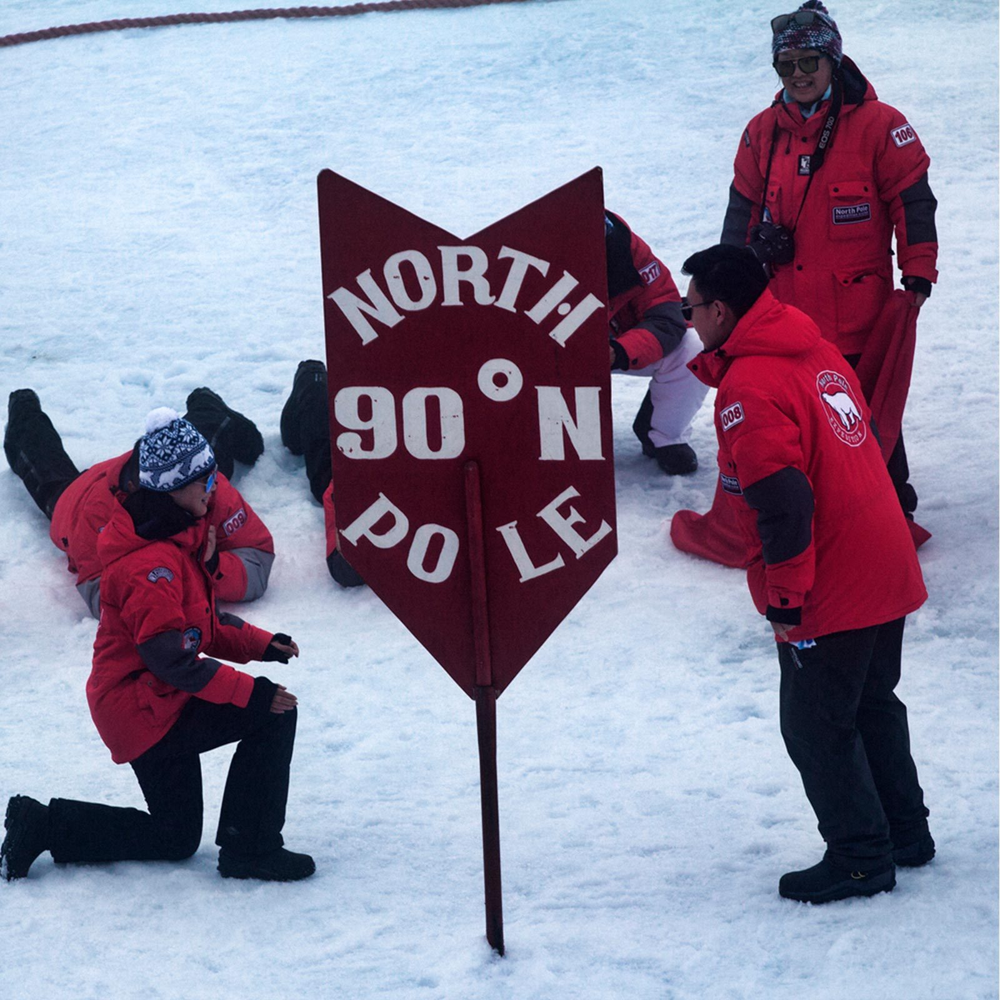

# december '25
on sharing a watermelon | 30 min

---

I've officially decided to relegate *today I learned* to its own subcategory. with that comes another change: I'll be writing about each learning as I go instead of all at once a month later.

the hope here is that it'll feel like less work if I just do a bit everyday. it'll also all be fresher on my mind so I'll probably be able to write a more thoughtful explanation for each one. and most importantly it'll feel like I have a lot more time to write other things. as much as I love *today I learned* I don't want it to take over completely.

ok but I since I am writing most of this in one sitting I will provide a little life update: over the past week, I've been to NYC, Lisbon, Madrid, then Lisbon again, then Seville, and finally Lisbon again. and I have been having a great time. very grateful. I hadn't been to NYC in like 15 years and I frickin love it. I love how stereotypically New York it feels. it feels like a caricature of itself. and I love the snow. and the fact that rats roam the parks like squirrels. and I especially love all the characters you spot around the city. I love characters. 

it's also been great seeing my family and some friends again. unrelatedly, I've become convinced lately that you're not really friends with someone until you have shared a watermelon. or any large melon-like fruit I suppose. but not a precut melon. you need to crack open the watermelon together, cut it up, and distribute the pieces. or you're not really friends. if that feels arbitrary I don't care. ideally it would be outside on a lawn or a picnic table on a sunny day and the watermelon would have seeds so you can spit them out. or swallow them if you want I don't judge. 

why have I drawn this boundary? think about it. who in your life have you shared an entire watermelon with?? most likely the list consists of all the people who you know the best. it's an extremely inconvenient fruit. you're not likely to share it with someone you don't know very well. 

if I'm wrong about this please don't tell me just let me have this one please please I'm begging you1

## today I learned: december '25 edition

### 1. vinyl records have markings indicating a new track

yes I got a record player a few months ago. it's exactly the one that people warn you not to buy but I don't care I like how it looks and I especially like how cheap it was. 

the speaker did break after just 2 months unfortunately, but that's ok it has bluetooth. 

anyways I do understand how pretentious it is to own a record player, but tbh I think the positives outweigh the negatives. on one hand, it's extremely cool. come on. the whole ritual of taking the stylus guard off, unclipping the hand, lifting it up, and watching it slowly drift down onto the record is just so fun. it makes putting on an album feel like an event. 

then there's the whole idea of ownership. you OWN that music. nobody can take it away from you. that's not true of streaming. then you think of all the Spotify and big tech controversies, the commodification of music, the imbalance of power between artists and higher ups that streaming claims to dispel but really doesn't, and suddenly going retro doesn't seem so bad.

that being said I am a total hypocrite because I don't plan to end my Spotify subscription anytime soon.2

anyways. it took me 4 months to realize records have marks on them indicating the start of a new track. I thought people just put certain songs on by trial and error. but nope. I only noticed once someone pointed it out to me. to be honest though, I think if you're going to put a record on you might as well just listen to the whole album at that point. 

but good to know.

### 2. the north pole has a sign

and it looks like this.

another fun fact which I think more people know about is that the north pole only experiences one sunrise and one sunset per year, both of which last a few weeks. the rest of the time you get perpetual day or perpetual night. which sounds cool but would defintely become a nightmare after a few weeks.

### 3. generative AI DAW in Suno

> *I want to preface this one by saying there is nobody who is more AI*
> *fatigued than me. I'm so sick of hearing about it. that being said, I've*
> *noticed a general sentiment towards it in certain communities (mainly* 
> *creative ones) that feels misguided to me. so I want to talk about it.*

you've probably heard of Suno and chances are you don't have a very high opinion of it. maybe you've heard an AI generated song or two and thought "wow, this is terrible." that was my experience too. 

as far as I can tell, the general sentiment around the use of generative AI in music production (and the arts in general) is super negative. people hate it. they think it'll cause a flood of mediocre music into the market, increase the amount of competition to the point where it's impossible to get any attention as an independent artist, and overall be a huge disaster for music, the arts, and humanity as a whole. I understand why people are worried. it's scary when something new comes up and seems to threaten your whole way of life. I used to feel the same way.

if I am being super honest though, I'm not worried about it anymore. it's possible I don't have a complete understanding of the concern, so if I'm missing something please let me know. but as someone who has devoted the last 3 years of my life to learning how to make music, I see only positives to lowering the barrier to entry. we don't need more gatekeepers in music. we have enough of those elsewhere. 

here's a few sentiments that I see expressed a lot arguing against generative AI in music:

#### 1. it'll make it harder to be noticed as an artist.

on the surface this seems to make sense. if we flood the market with new music, how will people know what to pay attention to? how do you cut through the noise as a new artist?

but let's be real, we already live in this world. as of 2024, there are over 100 MILLION songs on Spotify with tens of thousands more being added every day.3 not to mention the other music platforms out there. it is literally impossible for anyone to even be aware of all the music that's out there, much less have listened to it all.4

I don't think adding AI generated music will make a huge difference.

#### 2. it's devaluing human produced art. 
I would say it's the opposite. I think this argument follows a similar line of thinking to the last point. if we flood the market, everything becomes less valuable. supply and demand etc etc.

I think this argument ignores some of the nuance in judging art's value.5 what makes art valuable? why do we enjoy it? a huge reason is the story behind it. the perspectives of the person who made it. the connection we feel as part of a cultural movement.6

there are so many examples of this. the Mona Lisa gaining international acclaim after it was stolen from the Louvre. every Taylor Swift album ever and all the insane lore behind the scenes. so many songs that lie dormant for years and then randomly blow up because of a new movie or TikTok trend that feature them. I could go on and on. a good piece of art is a window into a larger story.

what story does a song that is completely AI generated tell? I guess there is some novelty in the fact that it's the product of a new technology, but where do you go once that wears off? you can try to manufacture some lore (which a lot of labels already do for their souless pop stuff) and maybe that will be semi successful, but I think it's much more likely that people see through it and aren't moved as much.

#### 3. it was trained on stolen work.

this used to be my biggest point of contention. it seems wrong to let large companies profit off of the backs of struggling artists. I still feel that way, but I'm not sure that picture is fully accurate. obviously I don't know the details of the training process for the models that Suno or any other platform uses, but my suspicion is that they likely use as many songs as they can get from as many sources as they can get. for that reason, they're currently being sued by large music labels like UMG. 

we've seen this story play out before in other lawsuits and my understanding is that it has been ruled as transformative. which does make sense to me. the deeper concern is not whether Suno is stealing from large corporations because let's be real, who cares about that, but whether they are stealing from independent artists. personally, I don't think they are. 

I've gone back and forth on this point, but it seems to me that what they're doing is no different than what any artist does. they consume thousands of songs, are inspired by a few, and recombine parts of those in interesting and exciting ways. that's what creativity is. 

I'm struggling to see a difference between a human doing it and an algorithm doing it, but maybe there's something I'm missing here. I would love to be convinced otherwise. I will also add that by the nature of how these models work (e.g. predicting what is most likely to come next blah blah blah), they are much less likely to create anything interesting that we haven't seen before without any human guidance. which leads me to my next point.

#### 4. the stuff it makes is aggressively mediocre.

I've yet to come across an interesting AI generated song. as far as I'm concerned, they don't exist. some people use this as an argument against it. it's pretty clear this is not a good reason to be anti-AI. 

with that logic, any new artist should immediately stop making music. maybe it'll someday get to the point where it can create technically interesting and surprising things, but to me it seems that as long as the human element is missing it won't be worth paying attention to. 

that's not to say there isn't a place for less interesting art. obviously there is. like music for a commercial. most likely that's the niche that AI generated music will fill. any place where the story of the music doesn't really matter and is more of a means to an end. 

actually this is already happening.

#### 5. it will make it more difficult to make a living in music.

a few months ago Coca Cola made an entirely <a href="https://www.youtube.com/watch?v=Yy6fByUmPuE">AI generated ad</a>. including the music. the reception seems pretty bad, but I think that's mostly because of the general sentiment around gen AI. to me, it seems like a perfect fit. I think in this case in particular Coca Cola did it for the attention (which is why they said it was AI generated; nobody forced them to do that) but surely there are plenty of other ads that use AI generated music and other assets but don't come clean about it. 

a company isn't incentivized to create interesting music in their commercials. they just want something passable. and gen AI is great for passable. 

the drawback here is pretty clear: many musicians depend on the money they make from odd jobs like commercials. if you eliminate that, suddenly it becomes much harder to make a living as a musician.

I don't have an argument against this. it's an unfortunate reality we live in. 

one thing I will say is that nobody can take performance away from musicians. that will always be a good way to make some money. you're probably going to be performing other people's music, but it should be enough to keep you going. 

#### 6. it's destroying the environment.

I see this point brought up a lot. there's a worry that the massive data centers that are being used to train and run these models are consuming excessive amounts of energy for limited return and have an exceedingly large carbon footprint. 

yes, they do have a large carbon footprint and I also wish more work was being done towards improved efficiency. but the truth is, the impact of data centers on the environment is absolutely dwarfed by the effects of factory farming and transportation. 

does this make it ok? no. but it's important to pick your battles. the battle against factory farming has a far larger impact on carbon emissions than the battle against data centers. it's not even close.7 

once we figure out the farming situation we can focus our attention on the next issue.

#### getting to the point now9

ok enormous tangent aside, I learned that Suno is working on a DAW. if you don't know, a DAW is what producers use to arrange music. if you've ever used Garage Band, it's like that. 

what's interesting about Suno's DAW is that it lets you generate little pieces to help your arrangement. for example, if you have an idea for a trumpet part, you can record yourself humming a melody, and tell the DAW to create a trumpet part from it. or you can ask it to generate a bass line over your chord progression.8 I think this is undoubtedly the future of gen AI in music. a tool to make the lives of musicians easier. nobody wants to listen to a song that is entirely AI generated, but they would definitely listen to one that is entirely put together by a human with the help of a tool. 

it's basically sampling on steroids. and it brings the power of a large budget to your bedroom. it's super expensive to hire an orchestra to perform your piece. suddenly, the barrier to entry for certain styles of music falls drastically. this is super exciting to me!

as a last note, there is never any substitute for learning the basic building blocks of a craft. you can take a shortcut and let a tool do most of the work for you, but if you have no understanding of what's actually going on behind the scenes and why it works, you're going to have a hard time making something meaningful. there's no replacement for genuine mastery. we've seen this happen before. details are abstracted away to make people's lives easier, but it remains important to understand how things work under the hood. the same will be true here.

all that being said I haven't actually used the DAW because I don't want to pay for a Suno membership lolz but it's clear to me that music production is very likely to go in this direction in the next 5 to 10 years. 

### 4. the contrabass balalaika

I am becoming increasingly aware of oversized instruments such as the octobass and the contrabass recorder. which I think is a very positive development in my life.

for context, the balalaika is an eastern european lute-like instrument with three strings tuned to E, E, and A that you pluck like a guitar. it's shaped like a triangle for seemingly no reason and sounds like an extremely bright banjo or mandolin.

of course there also exists an oversized version. it looks like this. 

here's a <a href="https://www.youtube.com/watch?v=YtAWkLxXWTo">video</a> of someone playing it. it serves literally 0 practical purpose that I am aware of but it does look fun and also the designers were thoughtful enough to round out the edges so that they don't stab anyone. amazing.

### 5. mereology

mereology is the study of part/whole relationships. there are so many big questions here that are very difficult to answer. you've probably heard of the ship of Theseus. the idea being if you replace every part of an object, is it still the same object? at what point does it stop being the same object? 

there's also the idea of what makes an object, an object? for example, we know a bikini consists of a top and a bottom. if the top and bottom are placed directly next to each other, it's pretty easy to see that it's a bikini. is it still a bikini if the top and bottom are placed miles away? you can apply a similar line of thinking to any number of things. eventually, it starts to be clear how arbitrary our ideas of objects are.

we can go even deeper to the atom level, but I won't. fun to think about though.

### 7. what is a rostrum

it's a beak-like snout 🤯

I was doing connections and this was one of the words 

### 8. ethical emotivisim

I think humans are inherently a force for good. my own lived experience tells me this as does my intuition. that's not to say everyone is always doing good. I understand people have off days or their incentives are misaligned or they have some deeply set misunderstanding or they do bad things out of desperation or weakness or... any number of other reasons. I talk about this in detail in my post "on inherent goodness."

over the past few months I've been thinking about it a lot again. there have been certain things in my life that have challenged those beliefs. I've thought to myself a few times, "maybe I'm being too optimistic." 

but I always land back in the same place. honestly I'm really grateful for it because time and time again when things like this happen, I'm able to prove to myself that I really do believe what I say. a worry that pops into my head sometimes is whether I'm just telling myself a story to feel better about the world. but it's clear now that's not the case.10

but in thinking about this, I've realized it's all a bit meaningless if I don't have an understanding of what "good" means and where that comes from. I know this sounds silly and obvious, but that's my motivation for digging a bit deeper into ethics.

there are two major schools of thought on morality (as far as I know): moral absolutism and moral relativism. absolutism claims there is one single correct foundation for morality that everyone in the world must adhere to. in other words, everyone follows the same rules. relativism makes the opposite case that "good" is entirely subjective and what's good for one person may not be good for another.

to me, it feels pretty clear that things are relative, but it is an area of a lot of debate. although it sounds good on paper, moral absolutism feels a bit dangerous. who's going to set the rules? it gets problematic very quickly.11 relativism is also a bit shaky since it opens the door to unresolvable conflict.12

in either case, the idea of the source of moral principles does come up. either from a higher power, or out of practicality, or purely as any other idea in culture. ethical emotivism argues that our morals are based on the emotions we feel in response to certain actions. there is a LOT more for me to learn about here, but that's the basic idea as I understand it. 

the next question then becomes "well, why do we feel the way we do about things?" some people will tell you it's god's influence while others will say it developed over thousands (millions?) of years of natural selection. those with a strong moral compass oriented towards promoting humanity's wellbeing passed on their genes until the others died out.

it does feel a bit strange to say that so many of the most important decisions we make are entirely based on emotion. maybe I'm misinterpreting the idea, but that's what it feels like to me.

the truth is, there are a lot of unanswerable questions here. that being said, here's my idea of "good" compressed into a single sentence: anything that promotes the general wellbeing and happiness of as many sentient beings as possible.13

not exactly groundbreaking, but there you go.

### 9. twin banana

I bought a banana from costco and when I peeled it there were two little bananas in there heh

they were delicious.

### 10. ukulele comes from the machete

a machete is a portuguese instrument that looks a lot like a ukulele. it's basically just a tiny guitar. very fun and cool

### 11. walking stick guitar

its a great idea although I don't ever see myself walking around with a cane (hopefully). but if you're going to have a cane you might as well stick a guitar in there. 

### 12. why does salt melt ice

it snowed for the first time today and it made me so happy. I love snow. anyways everyone's busting out the salt for the pathways and roads and such and I realized I never really understood why they did that. like I knew it was to melt the ice but why does that work?

it turns out the freezing point of salt water is a bit lower than the freezing point of fresh water. the urge to factcheck myself right now is so strong but I'm on a plane as I write this so I can't. so if that's not true or misleading in some way I apologize. anyways moving on.

### 13. the state "blue berry" of north carolina is the blueberry

basically north carolina put on a contest in which the winner got to determine what the state berry was. unfortunately it ended up being mostly kids in the contest (maybe by design, I can't remember honestly) and two groups put on very good competting campaigns, one for strawberries and one for blueberries. I know my answer.

anyways this led to the compromise that created the state "blue berry" and the state "red berry." I do wonder how far they would be willing to go. how specific can the state "_____" get.

you know this could also just be completely made up and I would have no way of checking. it's ok maybe I'm better off not knowing.

### 14. mary's room

more philosphy woo hoo. but this one's interesting. the thought experiment goes like this: a girl named Mary is born in an enclosed white room where she stays her whole life. she's never able to leave the room, but she does have access to a book which contains detailed descriptions of every concept in the universe. but that's all. only black and white text descriptions. she reads the entire thing and internalizes it.

when she leaves the room for the first time and sees the blue sky and the green grass, has she learned something new?

the answer seems to be yes. she'd never seen the color blue before. now she has. this points towards the fact that an experience, like seeing the color blue, is impossible to distill into words. you can give as many synonyms for blue as you want, but there is no replacement for actually experiencing it. 

now that I think about it again though, it does seem like there is at least one way to encode the experience of the color blue. that's what our brain does when we see it. it fires off a series of neurons that altogether form the experience of seeing the color blue in our minds. there's no reason why we can't capture that in another way, as a binary string or whatever.

if that's the case, it must be true that Mary's book contains a representation of this encoding, as well as a way of interpreting it (since it has all information in the universe) that leads Mary to experience the color blue without actually having seen it. am I missing something here? hmm

I guess the question becomes is it possible to take a binary representation of neurons firing and perfectly recreate it in someone's brain such that they experience whatever was encoded. I don't see why not. like it wouldn't be easy but if you're able to recreate it perfectly it seems like it would be the same thing. 

### 15. tritone substition

I'm trying so hard to remember the details of this one but I really cannot so let me try to just make something up based on the name and I'll see if it's right later.

a tritone subtitution is a type of chord substitution that replaces a chord with one where the root is a tritone away (this is the part I can't remember). it's done in order to accomplish a chromatic voice movement that makes the progression sound a bit more... progressive rather than jumping around from note to note.

### 16. there's a section of venus's atmosphere that is habitable

I always though of Venus as this super hot planet because of the greenhouse effect it has going on. which it is. what I didn't realize but makes perfect sense now was that, just like Earth, the farther you get away from the surface the cooler it gets. so there is actually a sweet spot somewhere in the atmosphere where humans can survive comfortably.

whether or not it's actually practical to do so is another question.

### 17. pope francis was born on december 17th

rip

### 18. there's a city in New York called Yonkers

yonkers

### 19. peter cooper invented the steam engine

I know because there's a statue of him in NYC and I looked him up and tbh this is all uninteresting I'm only including this because he has a funny beard 

insert beard pic

### 20. the empire state building is in ktown

who knew. nyc ktown is so different compared to la ktown. but that shouldn't surprise me considering how different the rest of them are. anyways I got dim sim across the street from the empire state building (which yea I know that's not korean) and it was very good

### 21. rodents make up 40% of mammal species

I think rats get too much hate. it makes no sense to me. like I know they carry disease and stuff but so do humans. most rats are a lot cuter than most humans. I will die on this hill.

### 22. wet bulb temperature

it's different than air temperature. bascially, it's the temperature that a thermometer would read if soaked in water and placed outside (I think). the aboslute max humans can survive is just 35 degrees Celsius which feels concerningly low but tbh I also don't really know how wet bulb temperature typically compares to normal air temperature.

### 23. the first vaccination was for cowpox

which is why we call them vaccinations. the word comes from the word vaca, meanining cow in Spanish

### 24. why my ears don't feel pressure when flying anymore

when I was growing up I always had an insane pressure build up in my ears whenever I flew. it felt like there was a bunch of water in there and I couldn't get it out. the only way for me to get rid of it would be to yawn but I couldn't fake it it had to be like a sincere yawn effort.

anyways I never get that anymore. I'm not entirely sure why. my best guess is the muscle that regulates pressure in my ears just got better at it after many, many flights. that in combination with a potentially better pressurization system in recent airplanes? I don't know. that sounds right.

### 25. the extreme poverty line is set at $1.9 per day

in other words, every day you can spend only $1.9 on food, water, shelter, healthcare etc. which is mindblowing to me. 10% of the population lives at this level as of last year.

it feels like this should not be a thing in 2026 like we have more than enough resources to share. what is preventing us from doing so?

### 26. in the 1800s people lived with friends for months at a time

what is the socially acceptable amount of time to stay with a friend? I guess the answer depends. not only on how close you are, but also what time period you live in. in the 1800s people regularly stayed at a friends house for 6 months at a time and it wasn't frowned upon.

I think I would probably also be fine with that like I would be happy to help out if we're good friends. it does start to become a bit more difficult if you don't live with other people though that feels wrong to burden them in that way.

anyways

### 27. orchid synth

it's basically a toy for grownups. co-created by Kevin Parker of Tame Impala fame it's a synthesizer that let's you play chord progressions very easily. basically you have a keyboard and you use that keyboard to select your root note. than you can pick your chord type (major, minor, 7, minormajor11#13b5) and one of a few voicing presets and bam. you have you chord progression. you can loop over that and figure out some kind of melody on the keys.

it looks pretty cool and fun and it ONLY costs $900. 

### 28. omniscience and omnipotence are incompatible

what is omniscience? the knowledge of everything that has every happened or will happen.

what is omnipotence? the ability to do anything.

why are they incompatible? if you have the ability to do anything, then you have the ability to change your mind. if you have the ability to change your mind, you must not be omniscient since you didn't know ahead of time that your mind would change. 

so you can't be both.

### 29. alcubierre drive: ftl travel

most people know that nothing can travel faster than light. it's physically impossible. the reason is that as you get closer and closer to the speed of light, the energy you need to keep accelerating increases exponentially to infinity.

an alcubierre drive is theoretical device that would enable FTL travel. basically instead of accelerating an object, it would bend space itself to enable what is essentially teleportation. think like a wormhole or something like that. 

pretty cool although who knows whether it is actually possible

### 30. competing dalai llamas

the dalai llama is the spiritual leader of buddhism, normally based in Tibet. unfortunately right now he's living in India due to threats from China. as far as I understand, Tibet is one of the territories that China claims to have authority over. unfortunately for them, the majority of Tibetans don't agree, including the dalai llama.14 

because of his influence over the Tibetan population, China sees the dalai llama as a key figure in their conquest. if you control him, you control them. 

so naturally they'll do whatever they can to get control of him. this includes potentially hijacking his succession process. buddhists believe the dalai llama is reincarnated when he dies, and succession involves scouring the country to find a kid who could be his replacement.15 

when the dalai llama dies, it's expected that China will put forth their own successor who will advocate for Chinese control of Tibet and will do whatever they can to suppress the typical Tibetan succession process. they've actually attempted this before, unsuccessfully. 

I sincerely hope they fail again. 

### 31. piano roll is very fun

piano roll is a way of programming music in Logic Pro (and other DAWS). it's been super fun for me to mess around with because I'm able to express all my ideas exactly how I want to without any limitations from my technique. which is great for me because I'm not very good at piano yet. I'm confident I'll get there someday though.

in the mean time, it's nice to have something like piano roll that makes expressing yourself so easy. I don't know why I didn't try it out sooner.

that's all for 2025 woohoo yay wow so much learning and only a small percentage of it is completely misinformed see you next year I mean next month goodbye see you later

---

(1) *this is a joke if you strongly disagree with this please tell me I am curious why*

(2) *don't you dare bring up sunk cost fallacy*

(3) *<a href="https://expandedramblings.com/index.php/spotify-statistics/">source</a>*

(4) *if you're curious, it would take about a thousand years, assuming you ignore all the new music that's created after you start and that Spotify and our current technology and societal strucuture and humanity itself survive that long*

(5) *which I realize is a very ugly phrase*

(6) *obviously there are more reasons to enjoy art than this. but I think these are the back bone of popular art. you can also appreciate the technique or the skill that goes into a piece if you have a good understanding of the art form and that's totally valid too.*

(7) *about 10x more.*

(8) *you can kind of already do this with midi but that tends to sound really fake without a lot of extra work done to make it feel more natural. generated trumpet music also doesn't feel exactly like a live performance, but it gets a bit closer than raw midi.*

(9) *one last thing I want to touch on is a pretty common talking point I've noticed which is that AI generated content is too perfect and therefore will always be uninteresting. I'm not convinced by this. I feel like it would be pretty easy to train a model to mimic human-like imperfection. the deeper problem is that of story, connection, and intent. you can't replicate that.*

(10) *sometimes it's hard to tell what you actually believe until it's put to the test. if you don't actually believe something, you're not going to act against your own self interest in order to demonstrate that you do. a bit of a heavy example here but it's the only one I can think of right now: if you've lived the past 20 years of your life advocating for natural remedies over chemotherapy, but then decide to get chemo once you're diagnosed with cancer, it's clear you never really believed what you had been saying. that's not to say you're not allowed to change your mind, but you know what I mean.*

(11) *ironically, many truly horrible things have been done in the name of moral absolutism.*

(12) *although it does feel like any moral system regardless of source is bound to have its fair share of contradictions and trade offs*

(13) *a definition like this opens the door for so much criticism which honestly I would love to hear if you have any. one that I can think of is that it's a bit broad. two people could have completely incompatible ideas that fit this same definition. does that mean both are good? I guess it's ok for two good things to be incompatible. there's also the whole trolley problem of it all but I am ngl I don't want to get into that. I also want to add as a final note that I don't think "evil" is necessarily the complement of the set of good things. in other words, just because something isn't good, doesn't mean it's evil. that sounds super obvious now that I've actually typed it out but while we're making definitions I might as well make that clear. weirdly, a definition of "evil" feels trickier to me than a definition of good.*

(14) *to be clear, I don't fault China for doing this any more than I fault the US for it. it's obviously unethical to take over a nation and culture and impose your will over them and I will say that no matter who the culprit is*

(15) *this involves a number of tests that theoretically only the spirit of the dalai llama could solve. which should sound very familiar if you've seen avatar*