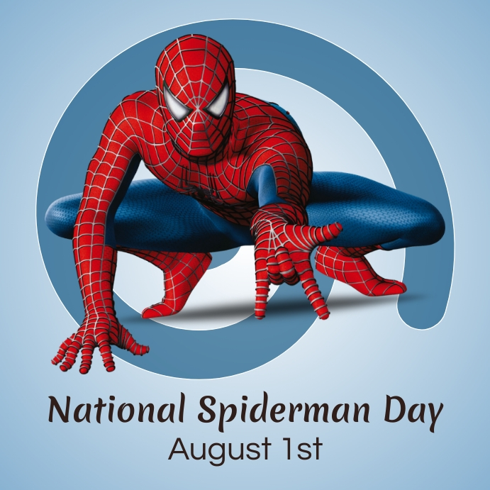

# on a roadtrip
staring into the abyss until the abyss spits out 26 ideas 😁 | 7/26/2025 | X min

 ---

 I recently went on a road trip from the west coast to the east coast. over the course of 7 days, I drove 2519 miles, passed through 8 states, slept in 5 scary, rundown motels, encountered 3 wild donkeys and 2 stray dogs, and was pulled over for suspicion of being a drug mule once. 
 
 this will not be about that because that is boring. I mean I don't think it's boring, but for some reason whenever I try to tell people about it their eyes glaze over. so either I'm a bad story teller or it's a bad story. 

anyways. when you're driving 8 hours a day, you'll do literally anything to fill the time. but eventually you grow tired of literally anything. at least I did. you can only listen to so many podcasts and so many songs before they all start to sound the same. and before your ears start to hurt.

so I would give myself breaks. a few hours here and there where I just let my mind wander. in that time I had some of the best (or maybe worst) ideas I have ever had and I feel that it would be a crime to not tell anyone about them. I was finding it difficult to casually slip them into my day to day conversations (e.g. *"oh yea btw I think men's bathrooms should put urinals in stalls instead of being exposed to the open air"*), so here I am.

most of these ideas I have no hope of ever implementing myself, but I still think they have the potential to change the world, and I say that in the least presumptuous way possible.

## not changing the world

I debated whether or not I should categorize each of the ideas and present them that way, but I decided they are better consumed in the same chaotic way that they came about. picture me at the wheel going 85 miles per hour in the left lane, the barren fields of oklahoma surrounding me on all sides, phone in my right hand as I dictate voice to text in my notes app. 

enjoy 👍

---

### 1. Having a pet with your partner should be a prerequisite to getting a marriage license.

hear me out. yes, I know not everyone likes animals. some people have allergies. others just find them annoying. as much as I disagree, I understand. but I really and truly think this would have a huge positive impact on society in so many ways. 

first of all, it gets a lot of stray dogs and cats off the street. huge win already. secondly, it's proof that you and your partner work well together. a trial run basically. I know what you're thinking... "not everyone wants to have kids dude." yea obviously. but it's more than that. EVEN if you don't want to have kids, proving that you work well together is absolutely essential. if you don't, it's probably not gonna work out. and you might as well realize that before you get the license. 

and on the off chance you do decide you want to have a kid, good news! there is a MUCH lower chance that they will be allergic to animals. or have any allergies at all. and that's good for everyone. I hate <del>people with</del> allergies.

### 2. Gardening should an elective at all schools.

how fun would that be. kids messing around in the dirt and growing food and feeling a sense of responsibility. how is that not a thing. is it a thing?? maybe it is somewhere, but it needs to be like gym class imo. wait is professor sprout's herbology class in harry potter based on real life? like do british schools actually have that? I remember finding out that the whole prefect and house thing was real and that blew my mind so maybe herbology is real too.

anyways shout out to the <a href="https://www.thelearninggarden.org/" rel="noopener noreferrer" target="_blank">learning garden</a> at venice high school (which I am realizing surely must have a gardening elective given the garden is so close). they put on little gardening seminars every now and then on a variety of topics including bees and pollination and a guide to growing tropical plants. you can also just go every saturday and sunday and help out around the garden. it's a good time. I wish more schools had it. 

### 3. Every city should have a crowdsourced mural.

basically we need to put a giant blank wall in every city center. anyone can paint on the wall and anyone can paint over anyone else's contribution. I should mention this idea is heavily inspired by <a href="https://en.wikipedia.org/wiki/Cadillac_Ranch" rel="noopener noreferrer" target="_blank">cadillac ranch</a> in Texas. but we can take it a step further.

I think above the mural there should be a giant timer counting down to when the mural is "frozen," at which point the wall will be taken down and replaced for a fresh start. maybe this happens once a year. 

the old wall will then be taken to a national mural museum that displays every city's murals from every year, and each of them essentially serves as a representation of that city's culture that year. eventually we'll build up an awesome mega mural that shows how national culture changes over time.

 if you're worried about costs I think it could pay for itself, both monetarily and through the community it fosters. when a blank wall is set up, we can charge something small like a dollar to paint it. but then as we get closer and closer to the freezing date we can charge more (say $50), since it's more likely that their contribution will make a lasting impression in the museum.

 there is a worry that vandalism would ruin the walls (and cast a bad impression of a certain city), but I think that would be part of the fun. it should be allowed. cities would just correct it themselves.

 this is such a good idea and if you know any city mayors please put me in touch.

### 4. Abolish all relationship related holidays.

I promise I'm not the kind of person who feels bitter looking at couples on Valentine's Day. maybe a little. to be honest, I'm also just not good at doing Valentine's Day things on Valentine's Day, even when I *am* in a couple. I don't know, I just don't think we should need a special day to tell someone you love them. they should already know. I shouldn't have to buy you roses and chocolate on February 14th at a 50% markup. I'll do it some other day. 

don't even get me started on national boyfriend/girlfriend day...

> 

> *fun fact: national girlfriend day and national spiderman day are both august 1st. coming up soon!!*

to be super clear, I also am referring to things like Mother's Day and Father's Day. it's all just overly commercialized holiday slop and it takes away from the specialness of the real holidays (in my opinion).

### 5. Abolish plastic bottled water.

this isn't a particularly novel idea, but it is one that I'm passionate about. I don't think you should be able to buy water in disposable, plastic bottles at the grocery store. there is literally not a single reason for it. we have all these perfectly good, resusable containers that we could use which 1) don't pile up in landfills and oceans and harm sea creatures and 2) don't contribute to rising microplastic levels in our bodies (which may or may not cause cancer and heart attacks and who knows what else).

I'm not totally against selling water in containers. I can understand that. like what if the tap water is contaminated? but there is literally no way to justify *plastic* bottled water.

while we're at it we might as well abolish all single use plastics. why hasn't anyone thought of that yet...

### 6. Birth certificates should include a name justication section.

in other words, parents should have to explain why they chose the name they did. like if they named you after your great uncle, that should be on the birth certificate. 

I feel like if that was required people would be a lot more deliberate about choosing names and then everyone would have a cool name back story and I think that would be fun.

### 7. Blockbuster action movies should undergo the "Airplane Test."

about a month ago, I was on a flight back home from Newark to LAX. the vast majority of the flight I spent watching the man in front of me watch red hulk beat the shit out of captain america 2 on his iPad Mini. it was awesome. 

this inspired what I call the "airplane test," which tests the ability for a movie to hold your attention even when you can't hear what's going on. like on a plane. red hulk nailed it. I mean yeah it doesn't suit all movies obviously but anyways something for all the blockbuster execs reading this to consider.

### 8. Once a week, higher grade students should be required to tutor lower grade students.

ideally, they would be only a year apart. this satisfies a few purposes. first of all, kids probably learn better from people they can relate to. secondly, it allows the older kids to reinforce their knowledge of the subject and really master it (there's the whole saying how you don't truly know something until you can teach it etc. etc.). 

beyond that, it teaches the older children how to communicate effectively AND simultaneously fosters empathy in them for their teachers (which is super super important in general -- it's not easy for a lot of people to empathize with authority figures, for obvious reasons). 

I've seen case studies of this working with the LA program at UCLA, but I think we need to start even younger. we see it all the time with sibling relationships (my sister taught me to read, not my parents or kindergarten teacher). it's super effective. let's get that in public schools. 

### 9. History should not be limited to history class.

I mean this particularly with respect to STEM. the pythagorean theorem would be so much more interesting if we learned about the pythagorean cult and how they forbade the consumption of beans and the precise way in which pythagoras proved what had actually already been known by Egyptians and Babylonians centuries before him. instead we memorize a song.

don't get me wrong, that's fun too, but the context is so important for making people care. these are real things discovered by real people and they are interesting and we are doing children a disservice by sterilizing it so much to the point that it becomes boring.

this is one of the points touched on by <a href="https://worrydream.com/refs/Lockhart_2002_-_A_Mathematician's_Lament.pdf" rel="noopener noreferrer" target="_blank">Lockhart's Lament</a> in addition to the general horribleness of the math curriculum in the US, and if you are someone who hated math growing up, I cannot recommend reading it enough.

but if you don't, this quote does a decent job summing up my point:

> *“To help your students memorize formulas for the area and circumference of a circle, for example, you might invent this whole story about “Mr. C,” who drives around “Mrs. A” and tells her how nice his “two pies are” (C = 2πr) and how her “pies are square” (A = πr 2 ) or some such nonsense. But what about the real story? The one about mankind’s struggle with the problem of measuring curves; about Eudoxus and Archimedes and the method of exhaustion; about the transcendence of pi? Which is more interesting— measuring the rough dimensions of a circular piece of graph paper, using a formula that someone handed you without explanation (and made you memorize and practice over and over) or hearing the story of one of the most beautiful, fascinating problems, and one of the most brilliant and powerful ideas in human history? We’re killing people’s interest in circles for god’s sake!”*

### 10. Students should have mandatory monthly presentations on any topic of their choosing.

keeping with the education theme, dedicate a whole friday to it. make it a party. bring pizza and cake and give awards for the most interesting presentations.

presenting is such an important skill and what better way to cultivate it than by allowing students to present on any subject they choose. too often in my classes I have seen other students deliver monotone presentations on static white slides with walls of black bullet points. it's because they don't care about what they're talking about, and they don't care to make other people care either.

and it's especially because they never learned to enjoy presenting. we can fix that. start them early!!!

---

ok that's all for now. I didn't cover every idea I had because this is already getting way too long and I want to save some for later. 

just as a quick note if any of these ideas seem ridiculous, it's because I'm joking. for all the ideas that actually seem good I am 100% serious.

also, just because it made me laugh looking back on it a month later, here is my original note where I described all the ideas I was having:

> *Log idea: five stupid ideas I’ve had stuff like it should be mandatory in schools to refute, stupid arguments, and all people in America under the age of 16 should be required to have a service job. You talk about these things. Explain why it’s important what implications it has in the world and they’re like simple ideas. Nothing too heavy but they’re just fun. Little fun little things to talk about. All children should have a pet growing up. Personal cars in large metropolitan areas should be outlawed. history classes should be required to put on shows for their students to act out the events of history. math classes should be more similar to what math actually is instead of just rote memorization. there should be mandatory weekly presentations in school where the students are allowed to present on anything they want related to the subject of that class so for example, in science class, you can prepare a presentation on whatever science related thing that you’ve learned. Learning journals keep track of at least one new thing that you have learned every single day. Gardening should be an elective in schools, and it should include raising animals as well. daily routine vending machines for blueberries, creatine vitamins, water all you can think of. Subtitle staring into the abyss until the abyss stares back. A keyboard where you can program the notes so that it matches all the fingers are the same right so you play in the key of c you put your finger on the first key right but then you can change what key it for what that note will be. Birth certificate should include a field that is a justification or rationale for why the parents named their kids the way they did. The airplane test for movies. Urinals installs in men’s bathrooms. indicators for a door being locked from the inside, so you don’t have to be worried or paranoid about having forgotten to lock the door. all trash cans should be converted into trash shoots that deliver the trash exactly to the dumpster where it needs to be to avoid the problem of taking out the trash. in order to solve the problem of neighbors upstairs being really loud, you should put a window in the floor so that the neighbor remembers that you are a human being and you exist and so they feel bad for stomping around at 2 AM. all classes should be taught in two parts. The first part is like an introductory overview that’s easier to understand it more like pop and then the second part should be all the same contact but covered in more death so for example, chemistry honors and then AP Ken immediately following. Addendum to the gardening class part of the class should be the students have to take care of animals from an animal shelter. Bottled water should be abolished. No more relationship related holidays. there should be a standardized certification for brands for products that tells you when it is as good as it is going to get it is at the peak point where things start to get diminishing returns when you compare price versus quality so it’s like giving the best bang for your buck. Oh, that’s already a thing. Yelp should provide a graph of price versus rating so you can see where the best restaurants are for the price in your in any given area. part of taking a class should be writing questions for that class or like writing problems because you never really truly understand something in my opinion until you can create something new related to it or create some investigation related to it create some problem related to it. In primary and secondary schools, the grade above should once one time per day be responsible for teaching the grade below. every city should have a dedicated wall for self-expression. Anyone can put anything they want on that wall and anyone can overwrite anything. They want on that wall inspired by Cadillac Ranch. different states should be able to customize their highway signs to fit their style. add museum showing each community and each year by year. Just like how certain cities have different street signs. I think it should be a thing for highway signs as well. All the concrete that is used in urban areas for like bridges and sidewalks and stuff like that should be dyed a special color so that it’s prettier to look at. Kids in school should be exposed to multiple perspectives politically and we should move to publicly funded elections.*