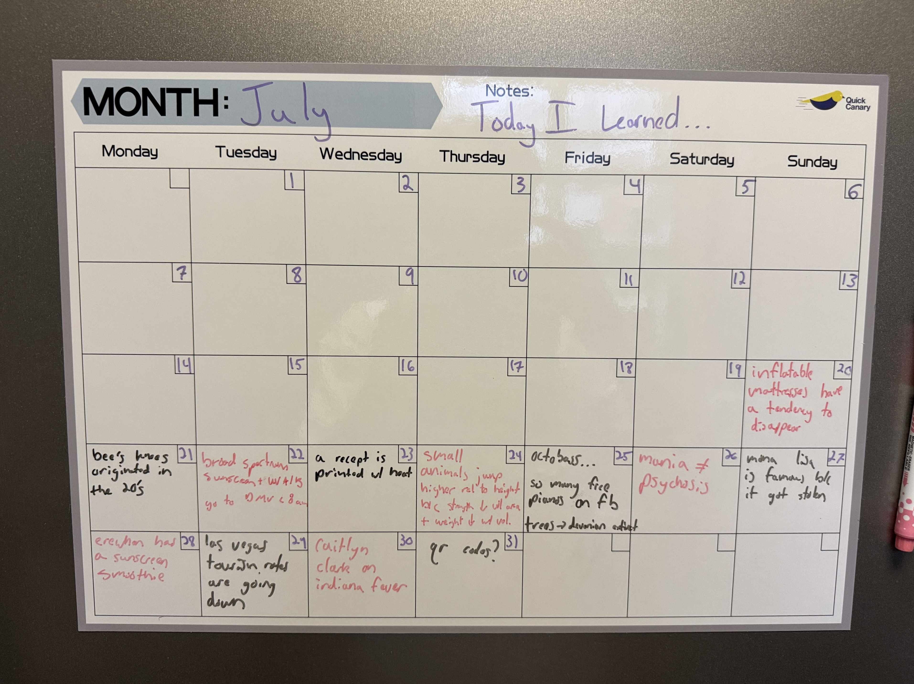

# on some things I have learned lately
and a formal apology to ms hallford | 8/10/2025 | 16 min

 ---

my high school english teacher is one of my favorite people. I didn't know her for a particularly long time and I didn't know her particularly well and honestly it's been so long that I'm not sure that she even remembers me. I wouldn't blame her. but I think about her a lot. 

she didn't have a particularly good reputation. actually, I just looked her up and found that she has a 2.2/5 on a website called ratemyteacher.com. granted that's based on only 4 reviews and I didn't even know rate my teacher existed until just now, but still.

I never understood the hate. to me, she seemed so deeply passionate and self assured in a way that I deeply admired (and try to replicate every day). unlike the overwhelming majority of my other english classes, I genuinely enjoyed the books she had us read — probably because she genuinely enjoyed talking about them — and I even felt compelled to participate in the class discussions. 1

just to drive my point home about the kind of person she is, I want to include one of her email announcements she sent a few weeks into COVID. for whatever reason, I was digging through the depths of my email a few months ago and found it.

> **Date**: 4/9/20 1:14 PM

> **Subject**: Spring Break

>*Hello Students,*
>
>*Just a quick message to let you know how much I appreciate all the hard work you have done the past several weeks. I know I demand a lot from you; you have earned my respect. I also appreciate how patient you have been with the education I have tried to provide--oh, those early Google Meet sessions--and how patient you've been with the slow grading and posting of grades. I never thought I'd say this, but I miss the papers!! Haha. Literally, that is. Grading online is exhausting. I miss my fountain pen sooooo much!*
>
>*Please know how much I miss you and how often I wish we were still together in the classroom.*
>
>*Spring Break starts officially at 3 today (except for you AP LIt students who have an 11:59 deadline for notes tonight!) and I do hope you get rest. You may have to work at it. I know that's a paradox, isn't it? Work at resting? But we become so involved, so consumed by tasks and deadlines, that when it comes to relaxing, resting, vacations, and being idle, we don't know how to do it.*
>
>*Ralph Waldo Emerson said "the world globes itself in a drop of dew." It does. Go outside, and look at a drop of dew... or a raindrop; in it you will see the earth and sky and your Self reflected there. What is without is within, and what is within is without. Go for walks. Feel the sunshine. Gaze at the night sky. Howl at the moon. Outside, you will discover what is inside of you.*
>
> *Take good care of yourselves and your families,*

> *Ms. Hallford*

I would be lying if I said I didn't get a bit emotional rereading that a few years later. especially because I know that I ultimately blew off her class once it was announced that grades were going pass/fail. at the time, I chalked it up to senioritis and didn't think much of it, but it's something I regret.2 I'm sorry, ms. hallford. you deserved better. consider this my formal apology.

anyways, I bring this all up because when I blew off her class we were in the middle of reading a book called The Once and Future King. you may have heard of it. it's a modern take on King Arthur. the old, animated disney movie, The Sword in the Stone, is based on it. 

when I abandoned her, I also completely abandoned the book.

a few years later, I decided to pick it up again. the guilt had caught up with me. I think I was on a date with my girlfriend at the time and we went to the Last Bookstore in downtown LA and I bought it for like $10. when I started reading again, I completely fell in love. T.H. White's prose is so uniquely jam packed with delightful, quirky little inconsequential details and his characters are so funny and interesting and the story is framed so well. I especially love the themes of peace and war and good and evil, and I think everyone would benefit from reading it even though it is basically a children's book. I'm definitely going to read it to my kids someday.3

## nine hundred words later...

there's a quote from TOFK that I really love. 

> *“The best thing for being sad," replied Merlin, beginning to puff and blow, "is to learn something. That's the only thing that never fails. You may grow old and trembling in your anatomies, you may lie awake at night listening to the disorder of your veins, you may miss your only love, you may see the world about you devastated by evil lunatics, or know your honour trampled in the sewers of baser minds. There is only one thing for it then — to learn. Learn why the world wags and what wags it. That is the only thing which the mind can never exhaust, never alienate, never be tortured by, never fear or distrust, and never dream of regretting. Learning is the only thing for you. Look what a lot of things there are to learn.”*

seeing it again recently, I felt inspired. especially because I just finished school and have officially entered the work force. a little late by some standards, but here I am: comfortably fulfilling my destiny of working a soulless, corporate 9-5. don't worry, I'm not bitter about it.4

but I don't want to stop learning just because I'm done with school. I love learning. learning makes me feel good. so to make a point of it, I'm starting my "today I learned" calendar, pictured below.

## ...he gets to the point

it's pretty simple. each day I have to write down one thing I have learned that day. if I want to I can write more. and then, to really nail it in, I'll write about each thing I've learned here and give some back story on it and it'll be super fun and a nice thing to look back at in 10 years. not all things will have that much to be said about them. that's alright. I should also note this month will have fewer facts since I started in the middle of july. I also want to be clear that these are not like ground breaking things. obviously. it would be impossible to learn something groundbreaking everyday. they're just fun little things that make me happy.

ok let's start.

## 20. inflatable mattresses have a tendency to disappear

ok not starting off super strong, but that's ok. I honestly don't remember why I added this? I think I was trying to fill out the calendar so I retrospectively added a few things to it. anyways it's a funny story, so I'll talk about it.

for context, I'm my ex-girlfriend's landlord. crazy statement, I know. but we're on good terms and it kinda just fell into place. I was looking for a subletter for my tiny, ground level leasing-office-turned-studio apartment for the summer and I jokingly suggested to her that she take it. I wasn't expecting her to actually do it, but I think we both fairly quickly realized that it would be mutually beneficial so it kinda just happened. 

here's an abridged version of the conversation:

ex: *Omg are u moving out too*

me: *i'm not moving out till later in the month thankfully. if u want to take over my lease july and august the invitation is open*

ex: *Ah that's good I feel like that'd be way too overwhelming otherwise. How much per month*

me: *whatever u want*

ex: *What that's not how this works. How much do you pay*

me: *I take the jews for jesus approach. but u should know the construction is really annoying and the upstairs neighbors are loud and there is no furniture*

ex: *Yeah hard pass*

me: *dang*

ex: *Well like, there'd be no furniture*

me: *who needs furniture*

ex: *Me*

me: *get a sleeping bag. bam. inflatable mattress. boom*

ex: *Bye I'm so dead*

me: *I think it's so funny u are considering this. but I would too it's a great deal*

ex: *But you haven't told me a price*

me: *that's what makes it a good deal*

ex: *Is it like you are trying to sublease it or just have someone take over*

me: *what's the difference*

ex: *Well the first would be like ur coming back I guess. And the latter is well that you're packing up for good. Goodbye La*

me: *yea packing up. goodbye*

ex: *Have you processed that yet*

me: *no. but I'm excited. ready for a change*

ex: *That's good. We can't always be in the harvest season of our lives so have to treasure it. If that makes sense*

me:

*yes makes sense*

*I am very fertile* 

*at the moment*

*and I do treasure it*

the main takeaways here are that 1) there was going to be no furniture and 2) I promised to leave her my inflatable mattress so that at least she would have somewhere to sleep. which I did do. I swear.

but for some reason two weeks later I woke up to 3 missed calls and a few texts saying there's no mattress. I genuinely have no idea what could have happend to it. my leading theory is that my landlord removed it for whatever reason, but she claims she didn't. then again, she probably wouldn't tell me if she had.

anyways this is definitely one of those things that will remain a mystery for the rest of my life. I'm ok with that.

## 21. the phrase, "the bee's knees" originated in the 1920s

ok this is a good one. I think I was listening to a podcast and someone said something was the bee's knees. which I've heard before obviously. but something about my mood that day (and partially the newfound pressure I felt to learn something new) compelled me to dig a little deeper into the meaning of the phrase. do bees have knees?? and if they do what's so good about them????? I had to know.

turns out bees DO have knees. but there's nothing particularly special about them. the phrase originated in the 20s as one of many nonsensical phrases that collectively described something good. so basically it only means something bc we decided it does. as do all phrases I guess. 

bring back saying things are the bee's knees.

## 22a. broad spectrum sunscreen protects you against UV A and UV B rays

I am a suncreen fiend. but you will not catch me spending more than the bare minimum on it. the neutrogena deodorant stick is my favorite, but banana boat takes a close second. 

you can understand why I grew a little concerned when I learned that not all sunscreen is created equal. SPF isn't the only thing to consider. you ALSO need to make sure that your sunscreen is broad spectrum to fully protect your skin. 

in short, there are two kinds of UV: A and B rays.5 UV A rays have longer wavelengths and are mainly linked to aging, while UV B are shorter and cause sunburns and skin cancer. broad spectrum sunscreen is certified to protect against both!

thankfully, my deodorant stick is broad spectrum, so I'm all set.

## 22b. go to the DMV before 8 am

I think in my heart I already knew this, but for whatever reason I chose to forget when I went to go get my new license a few weeks ago.

I walked in around 12:30 and the lady took one look at me and said "honey, we're full" and handed me a list of nearby DMVs and their opening times. she told me people start lining up at 4 am sometimes.

I love the DMV.

## 23. receipts are printed with heat

yea basically receipt paper is heat sensitive and any hot object will leave a black mark on it. pretty cool!

## 24. small animals jump higher relative to their height because strength scales with area while weight scales with volume.

have you ever noticed that squirrels tend to be able to jump super high relative to their height?? like pretty much the same height the average human can jump.

the short reason for this is that strength scales with muscle area while weight scales with volume. the larger an animal gets, the faster their weight grows and the strength can't keep up. the square of something (e.g. area) grows a lot slower than the cube of something (e.g. volume). neat!

## 25a. the octobass...

lately I've developed a fixation on weird, obscure instruments. or maybe not obscure in general, but obscure to me. for example, the guittarón is a giant 6 string, fretless bass guitar with a huge bulging body used in mariachi bands and I desperately want one even though I know it would serve no practical purpose in my life.

anyways I recently learned of the octobass. think of a standard double bass but two octaves lower (and twice as big). it's about twice as tall as the average man and requires levers in order to push down the 3 strings. there's only seven of them in the world. awesome.

## 25b. so many free pianos on facebook marketplace

pianos can get quite expensive. both to buy and to maintain. and obviously moving with them is quite difficult. 

I've learned that many people don't even bother and just put them up for free on online — with the caveat that you have to move it yourself. there must have been 5-10 free pianos listed in my area when I last checked, and new ones are being listed every day.

will keep that in mind once I have the space for one!

## 25c. trees once caused a mass extinction event

basically what happened was the rising tree population towards the end of the devonian produced a lot of nitrogen byproducts which leaked into the ocean through the soil. this caused massive algae blooms which killed 80% or something of marine life and started the carboniferous era.

I'll take a tree over a coral anyday but actually idk coral is cool too I want both

## 26. mania is not the same thing as psychosis

was talking to dr. sister about this and she confirmed that they are not the same thing even though they might have similar connotations. basically mania is characterized by an elevated mood and increased energy (which doesn't sound particularly bad until you actually see it in action) and psychosis is more of the traditional oh yea that person is seeing things that are not there. 

I realize this feels waaaaay too heavy for this blog post and I will make a note of that and try to keep it lighter from here 👍

## 27. the mona lisa is only famous because it got stolen

it's really not anything special. maybe that's ignorant of me to say. it just doesn't stand out to me. I was always a bit confused why it was so famous. but everything started to make sense when I learned that it was stolen from the Louvre in 1911 and the drama of it all propelled it into international fame. a good lesson in marketing.

## 28. erewhon has a sunscreen smoothie

yeah I don't know I haven't gotten it but if I had to get an erewhon smoothie I would probably get that one because it's the cheapest and I'm intrigued by the name. my hope is that it tastes like what sunscreen smells like because I love sunscreen smell.

wait just kidding it has been removed from the website so I can only assume they no longer offer it. dang.

## 29. vegas tourism is going down

actual recession indicator. idk. it would make sense. people have less disposable income so they don't gamble as much. and what other reason is there to go to vegas. 

I actually almost went this summer during my road trip but at the last second I decided to go to the grand canyon instead and I'm glad I did.

## 30. caitlyn clark is on the indiana fever

I barely follow sports but I have heard of caitlyn clark. I had not heard of the indiana fever before. what an insane name for a sports team. I would not want to be caught dead on a team called the indiana fever. props to caitlyn for overcoming that.

## 31. how qr codes work

there's a lot of details here that I won't get into but basically every qr code has orientation markers that let you scan it from any angle and it has data. data is represented (as you might expect) in a binary ascii encoding. so something like einarbalan.com becomes

 >01100101 01101001 01101110 01100001 01110010 01100010 01100001 01101100 01100001 01101110 00101110 01100011 01101111 01101101
 
 then starting from the bottom right and zigzagging up, each bit is represented as a white pixel for 0 or a black pixel for 1 (or maybe the other way around I cannot bothered to look it up right now). there's also a bunch of error correction redundancy built in so that you can still scan the code even if some part of it is damaged or covered. I would be lying if I said I could explain that part to you.

it is cool that we all collectively just agree that qr is the url encoder of choice like there could have been so many other potential formats and yet this is the one we all use. I'm sure there are others out there. I don't care enough to look into it right now.

anyways yeehaw to learning new things 

____

(1) *which, oddly enough considering how much I enjoy teaching, is something I really struggle to do.*

(2) *something I hate to admit. yes, I have regrets. for a long time I was one of those annoying people who claimed they had none, "because everything led me to this moment" and other nonsense. you can wish you had done things differently in retrospect. that doesn't make you a lesser person. in fact, it's probably a sign of growth.*

(3) *I have to admit that the middle two books aren't great, but they are more than made up for by the first and last.*

(4) *honestly, I'm pretty grateful. yeah, it's not the most glamorous, but my job is fairly easy compared to some others out there and it makes it possible to focus on things that I truly enjoy while also living a stable, cozy life. it's not a terrible deal.*

(5) *and a fifth called UV C which I won't concern myself with because it gets completely absorbed by the atmosphere.*