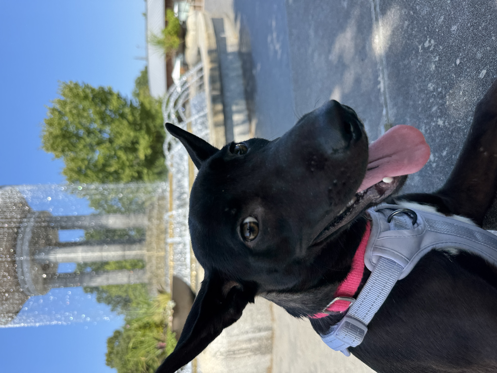
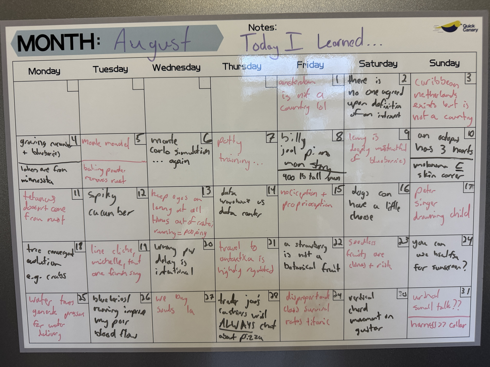

# on learning (8/25-9/25)
thank god I am free at last | 10/14/2025 | 30 min

---

for the past 6 months or so there has been a dark cloud hanging over my head. no matter what I did, it was always there. 

it was there when I sat in class struggling to pay attention to lectures about probabilistic programming. it was there when I layed in the grass at sculpture garden admiring the blue sky, purple trees, and insane conversations.1 it was there when I lay awake in bed at night in my tiny studio apartment, hoping and praying that my upstairs neighbor would stop playing their flute and moving their piano (which I swear they did a few times a week, always after midnight). 

I am of course talking about the horrible, dreadful, treacherous Master's capstone project. and now I'm finally done with it. am I proud of it? not particulary. am I proud of myself for getting it out of the way? yes, unimaginably so. I wasn't sure if I would ever finish. and yet here I am.2

the truth is, I made it a lot harder for myself than it needed to be. I could have taken the easy way out and just worked on some PHD student's project, probably working on something a bit boring. but I just couldn't bring myself to do that. it's not who I am. no, I am the guy who makes things as difficult as possible for little to no reward.

anyways this is all to say I have some free time on my hands. the cloud has dissipated and I am finally able to work on the things that I want to work on. that includes this blog, my music, a custom sized bookshelf or two, and my new dream of building a terrarium with a frog or a lizard or something. and of course there is the dog I have been fostering. don't be fooled by her smile. she is absolutely insane. 

all this free time means a lot of opportunity to learn some stuff. I'm so excited.

## today I learned: august edition

as you may or may not remember, I have been keeping a calendar with the goal of writing a single new thing I have learned on it every single day. 

the intent was to write a blog post monthly going in more detail on each thing, but due to the aforementioned cloud I was not able to last month. so this is going to feature both august and september's learnings. enjoy. I have to be honest most of these aren't particularly interesting, but that's ok. 

### 1. amsterdam is not a country

I know, I know. make fun of me all you want. when it comes to geography, I mostly go by vibes and the vibe of amsterdam is very much that it is a country. don't even try to tell me it's not. anyways I know the truth now. 

I made a similar mistake a few years ago. I thought that Jamaica was in Africa. I'm pretty sure I had it confused with Madagascar for whatever reason. anyways when I said it my friend burst out laughing and I was embarrassed and it still pops into my head every now and then.

I am curious how many more of these little inaccuracies are embedded in my head. like little landmines waiting to explode. only time will tell.

### 2. there is no one agreed upon definition of an introvert

basically I had an idea for a blog post surrounding my comprehensive theory of introverts and as research for that post I decided to conduct a few interviews. the problem was that the more interviews I did, the less sure I became that I had anything interesting to say about the subject. maybe it'll still come out someday. anyways sorry if I interviewed you, but thank you for having such fun, detailed answers. 

### 3. the caribbean netherlands exists (but is not a country)

yeah another geography one for some reason. it's exactly what it sounds like. some island in the carribbean controlled by the netherlands. one of the islands is called Curacao and upon seeing that I can't help but feel like I have been there at some point. I think on one of the cruises my family has dragged me out to. anyways yeah this exists.

I'm starting to think that maybe I shouldn't write about all of the facts. just the more interesting ones. would that compromise the project?

### 4a. how to grow cucumber and blueberries

on this day I was struck with the urge to grow something. I had a little bell pepper experiment last year and was able to get a single tiny, mishapen bell pepper out of it. but now that I have a patio and a ton of space, I decided I want to try again. my gut reaction was to get some blueberries going but after some research I decided I should probably start a bit smaller. blueberries require acidic soil and tend to be on the harder side as far as gardening goes. ultimately I went with the following (because they're generally pretty easy and quick to grow): cucumbers, pumpkins (but like little ones), baby bok choy, basil, spinach, carrot, onion, garlic, and bell peppers. 2 months later everything is going strong! 

except the spinach. I cannot get that to sprout for the life of me. I've tried everything. even threw them in the fridge for a week thinking they needed a colder environment. still nothing. also somebody keeps eating my bok choy leaves as they grow. that's ok they probably need them more than I do.

the cucumbers are absolutely killing it though.

### 4b. the lakers are from minnesota

yea I'm bored by this one but I seemed to think it was worth writing down at the time but anyways yea you might have wondered at some point in your life why are the LA Lakers called lakers?? there are no lakes in LA. well besides like man made ones. if there are real lakes that I am unaware of I apologize. but anyways the reason they are called Lakers is because they used to be the Minneapolis Lakers and Minnesota has plenty of lakes.

### 5a. gregor mendel was a monk

how cool is that. to not only be the guy who dreamt up the basis for modern genetics but also to be a monk. that's the dream.

### 5b. baking power removes rust

my blender was rusty. now it is not. thank you google.

I was reminded of that one scene from White Lotus. you know the one. as far as I know rust is not poisonous, but I'm not going to take any chances. only a crazy person would use a dirty blender.

### 6. monte carlo simulation... again

this is one of those phrases that people loved to throw around in my ml classes. in fact there was this one guy with a british adjacent accent that brought it up all the time and it always made me kinda roll my eyes, mainly bc I wasn't paying attention in my probability class when it came up.

in a nutshell, a monte carlo simulation lets you approximate the probability of an event through repetition. let's say you had a weighted coin that was more likely to land on one side or the other. if you wanted to determine the exact probability of landing on heads vs tails, you can just flip it a bunch of times and divide by the number of flips and as the number of times you flip approaches infinity, you get closer and closer to the actual probability. 

not super complicated despite the extravagant sounding name.

### 7. potty training

I mentioned lenny earlier. and her insanity. this is unrelated but she poops and pees like crazy. I am completely desentitized to it now.

 anyways initially I thought I would only need to take her out 2-3 times a day. that's absolutely wrong. if I don't want my floors to be covered in pee, she needs to go out at minimum every two hours. this is not made easy by the fact that she is deeply terrified of going outside, but that's a whole other thing. 
 
 she's wonderful I'm so glad she's here.

### 8. billy joel the real life piano man

ok everyone knows the song piano man. great song. what you may not know is that it was inspired by his actual run as a piano man at a place called the Executive Bar on Wilshire in LA. it's not there anymore. but yes he was a real piano man and he sang songs and there may or may not be a real John who is a friend of his.

also I learned how to play the opening on harmonica and I am very proud of it.

### 9. lenny is deeply mistrustful of blueberries

if you know me you know I love blueberries. I also love giving blueberries to people. I gave so many blueberries to squirrels at sculpture garden. they can have 1 or 2. same with dogs. 

one day I decided to share some with lenny and I put one in her crate and she freaked out. she was terrified. I felt so bad. she'd probably never seen a blueberry before. or maybe she has had a traumatic experience with berries in her past.

you will be happy to know that 2 months later she is a bit more tolerant of them, and will sometimes even try to steal a couple from me.

### 10. an octopus has three hearts

it makes sense when you think about it. they have eights legs. why not three hearts? 

### 11. tetanus doesn't come from rust

it's one of those correlation not causation things. tetanus is a bacteria that just happens to hang out in rusty environments sometimes. I have no idea why this came up I am not gonna lie

### 12. spiky cucumbers exist

california has a plant called a wild cucumber that doesn't look much like a cucumber and instead resembles a big spiky ball. they're not edible either if you were wondering.

# 13. NEVER TAKE YOUR EYES OFF LENNY OR SHE WILL POOP ON THE FLOOR

yea

### 14. data warehouse vs data center

someone asked me the difference between the two and I mistakenly told them that there was none. but that's not true. a data center is a physical place that might have computers running data warehouses. a data warehouse is like a historical database designed for data analysis.

### 15. beyond the five senses

we all know about the basic five senses: sight, smell, taste, hearing, touch. many also know there are a lot more than that. one sense is called proprioception, which is essentially spatial awareness. it's what keeps you balanced. there's also one called nociception which is essentially what makes you feel pain. although if you ask me this is more of a sub-sense of touch. I'm sure there are plenty more.

### 16. dogs can have a little cheese

even though the foster people told me not to give her food besides kibble I can't help it sometimes. also in this particular case I was just desperately trying to train her to go outside and I thought if I gave her some cheese everytime she did, then she would start to build a positive association. I was wrong. but she did enjoy the cheese.

### 17. if you don't give to charity you are a bad person

or so a guy named Peter Singer says. it obviously feels like it's not true, but I've heard that his argument is very compelling. so I bought his book and plan on reading it soon. 

briefly, he poses the following scenario: imagine you're walking to work and you pass a lake. and in that lake there is a child who is yelling for help saying they can't swim. there's no one else around. what do you do?

hopefully your gut reaction is to help in some way. maybe you jump in after them. maybe you call the police. but either way you take action.

Peter Singer's argument is essentially that there are hundreds of thousands of drowning children in lakes all over the world and it is your responsibility as a person with excess income to help them. what's more valuable to you: a new shirt or a child's life across the world? I'm sure there's more to it that I'm not aware of because I have not read the book yet. I'm not convinced yet. 

### 18. many tree species are not directly related

in other words, the characteristics that we think of when we think of a tree evolved independently many different times. you may have heard the same thing about crabs. just something about that particular form of life seems to do well on Earth.

in particular, pine trees evolved way before oak trees did. [this](https://store.dftba.com/products/the-map-of-plants-poster?srsltid=AfmBOop6fioHldivFoWzguS7WPm-Nrpd9VUPthrqZVm0PHT_xVuCK5gi) map does a good job showing how the different trees evolved independently.

### 19. the line cliche

it's one of the most common techniques in music. listen to Michelle by the Beatles. Les Rues de Paris. Nothing by Bruno Major. tons of other songs. 

basically it's when we have a chord progression that follows a descending note. for example, take the following progression:

> A7sus4 - A7 - A7sus2 - A7

you may or may not know that an A7sus4 is made up of the notes (A D E G), an A7 has the notes (A C# E G), and an A7sus2 has (A B E G). these chords each differ by one note and that creates a fun little melody as we go through the chords. neat!

### 20. the delay when you enter a wrong password is intentional

lately I have noticed that whenever I typo my password when I'm logging into my computer it always takes 3-5 seconds to tell me it's wrong. whereas if I get the password right it's instant. I was confused why this was. it doesn't seem like it should be harder to tell if a password is wrong vs it being right. 

anyways yea it's intentional. little security measure to make it slightly more inconvenient to bruteforce someones laptop.

### 21. travel to antarctica is highly regulated

obviously you can't just book a flight to antarctica. but even if you somehow manage to find yourself there, you're required by international law to stick to dedicated tourist areas. I mean it makes sense. for one, you kind of have to know what you're doing or you're not gonna have a good time there. there's also the argument that if just anyone can roam around there they might disrupt the natural habitat or some of the ongoing research. 

it does feel a bit weird that it's like... illegal. if you're from the US you can get fined $10k and a year in prison. there's probably more to this that I don't know about because a year seems a bit harsh. I would understand if there were like certain parts of it that were off limits, and the rest was fine but it's weird that it's the opposite. anyways enough about that.

### 22. a strawberry is not a botanical fruit

strawberry

### 23. all seedless fruits are clones

this one's interesting. plants come from seeds. seeds come from fruit. unless that fruit is seedless. so how do you get a new plant with seedless fruit if you don't have a seed to plant?

the answer is you have to clone them. there are a few ways to do that. one is to use cuttings. my limited understanding is that if you cut off a branch of a plant and plant it elsewhere, it can sometimes develop roots and become its own plant. there is one huge drawback to this approach though: all the plants are genetically identical. in other words, they are all susceptible to the exact same diseases and can very easily be wiped out if one comes along. I think this actually happened to a certain strain of banana sometime in the 20th century. 

### 24. you can use an HSA to buy sunscreen

in my old age, I have started to worry a bit about retirement. there are a bunch of accounts that I had heard of already: roth iras and 401ks. you probably have too. 

before this year, I had never heard anyone mention an HSA. it stands for health savings account. the idea is that if you have any health expenses you can pull from there. it's generally a good idea to put money in it because it can sit there tax free and depending on how much you contribute it can lower your taxable income enough to put you in a lower bracket. the catch is that you can only spend that money on health expenses. if you withdraw it for any other reason, there's a penalty and it gets taxed as income. 

anyways long story short, it's a good idea to have one as long as you have extra money sitting around. it does make you wonder what exactly qualifies as a "health expense." turns out it's a pretty broad category. you can buy things like sunscreen with HSA money. which is awesome. is this boring or is this interesting I can't tell

### 25. water towers are used to generate pressure for water delivery

there are a lot of water towers near where I live. this led me to wonder what the point of a water tower even is. like I get that they're used to store water. but why does that need to be done 100 ft up in the air? 

according to 5 seconds of research which may or may not actually be true, it's used to generate pressure to make delivering water easier. neat.

### 26. blueberries and running improve circulation

three things about me:
1. I have terrible circulation. my hands are always cold.
2. I love blueberries.
3. I love running.

I guess that's four things. anyways.

for a long time I thought that these were just disparate facts, but it turns out they are actually super related. I think the reason why I like blueberries and running so much compared to the average person is that they get my blood flowing a bit better. I can think clearer, I have more energy, and overall just feel better when I eat blueberries and run. 

idk if that's actually true or if I just want to believe it but it seems to have been working for me to this point.

### 27. we buy souls la

if you're from LA, there's a good chance you've seen a we buy souls sign. it's a white sign with "**WE BUY SOULS**" written on it in bold, black letters with a phone number under it. I initially just wrote it off as an ad for some weird cult, which I wouldn't put past LA. 

turns out I was wrong. it's actually the work of an artist named Rabi Torres. apparently he sometimes posts the messages he receives on [instagram](https://www.instagram.com/we_buy_souls/?hl=en). here's one:

> "*Hi, I'm white. I am still a virgin, so I think that makes my soul worth more. I would say at least, you know, $500,000, but maybe I'm just crazy. Give me a call back. I'm just curious how this works. Thanks and have a great day.*

I'm not sure I understand what it means to sell your soul and what exactly that would entail but pending terms of contract I would consider it.

### 28. trader joe's cashiers will ALWAYS chat about pizza ingredients

I swear there has not been one time I have gone to trader joe's and bought pizza dough and pizza sauce and cheese where they have not said something along the lines of "Pizza night?" or "someones making a pizza..."

I love it. never stop, trader joe's cashiers.

### 29. richer people on the titanic were more likely to survive

don't ask me why, but for work we had to analyze a titanic dataset. what immediately stuck out to me was to try to draw some kind of correlation between the amount somebody paid for their ticket and how likely they were to survive. insanely weird and morbid, I know, but that's kind of what they were asking us to do. 

anyways, as I suspected, the rich passengers were twice as likely to survive compared to those who paid less. yikes.

### 30. vertical chord movement on guitar 

if you play guitar, you know that chords have shapes. if your chord doesn't include any open strings, then you can move those shapes around horizontally on the neck to change what chord you're playing. for example, if you're playing a G major barre chord rooted at the 3rd fret, you can move that barre chord to the 5th fret to play an A major. this works for any chord shape. it took me way too long to learn that. 

anyways I just recently learned the same thing works if you move vertically. which makes a lot of sense, but feels slightly less obvious to me for some reason. you just have to be careful because of the 3rd interval between the 2nd and 3rd strings but anyways. very cool stuff 👍 

if you don't play guitar none of that probably made any sense I apologize

### 31. urinal small talk is normal???

at least at my office? on two separate occasions on the 31st I overheard two men having conversations at the urinals. the first conversation was about the weather and the second was about what seemed to be a mutual team member. 

has this always been normal? maybe it's a cultural thing. anyways you will never catch me talking to someone at the urinal.  

## today I learned: september edition

this is so long. I'm only half way through.

yeehaw

### 1. what is an exponable statement

basically, it's a statement in logic that must be unpacked into a few propositions. the classic example is "does your mom know you're gay?" I don't know if that's actually the classic example but it is an example. basically there are two propositions hidden in that one statement. the first is "you are gay" and the second is "your mom knows you're gay." 

a simple yes or no wouldn't be enough to answer both propositions, therefore it's an exponable statement. if you say no, you can't be sure if your answer is no because the first proposition is false or because the second proposition is false.

### 2. why do we celebrate labor day

hopped on a call with my mentor and he asked me how I celebrated labor day and I told him I have no idea why labor day even exists. he was eager to fill me in and explained how it celebrates the worker's rights movement which like... obviously. I feel like I knew that like 5 years ago but just forgot. anyways we talked about starting our own union in a way that neither of us were sure if the other was joking.

## 3. you can grow a whole head of garlic from just a clove

which I am doing now obviously. they sprouted like last week. good times

### 4. chord nomenclature

chords are named in a very methodical way, but one that can be a bit confusing if you're not aware of all the rules. I'm not going to list them all out here, but one that can be especially confusing is an example like Cmin7. You might think, "oh Cmaj7 has a major 7 interval in it, so Cmin7 must have a minor 7," which is true, but not for the reason you would expect. here's the rule:

1. if a chord has maj7 in the name, that's referring to a major 7 interval
2. if a chord has min in the name, that's referring to a minor 3rd
3. if a chord has just 7 in the name (without major), that's referring to a minor 7 interval

so some examples:
1. Cmaj7 has intervals 1 3 5 7
2. Cmin7 has intervals 1 b3 5 b7
3. C7 has intervals 1 3 5 b7
4. Cminmajor7 has intervals 1 b3 5 7

so basically the default is C7 with a major 3rd and a minor 7th, and we can modify those intervals by adding more stuff to the name. weird, but that's how it works.

### 5. reverse lightning is real

you've heard of lightning but did you know that you can see reverse lightning from space?? it looks like a little wormhole it's pretty cool. I don't know the science of it but I'm sure it's just something with voltage n electric potential and stuff

### 6. harry styles's real name is harry styles

the man was born to be a star

### 7. oreos originated on oreo way

in manhattan. this fact sounded cooler to me initially because I thought the name of the street predated the cookie. but it actually like the street was renamed in retrospect. anyways

### 8. nazis tried to teach dogs to speak??

like german. it did not work

### 9. why airport bathrooms don't have doors

you've probably noticed this. no airport bathrooms have doors on them. well maybe some do. most don't. I never knew why this was until I started working my current job. there's one small bathroom there for like 50-100 people and it has a door on it and I swear at least once a day I will run into someone trying to open the door from the other side. jump scare everytime. everyone I have spoken to agrees with me enough is enough we need to remove the door from the bathroom at the office

### 11. 3/4 vs 4/4 time signatures

you may have heard of these. 4/4 is basically the default way to count rhythym in music while 3/4 is often described as a waltz. I never really understood the distinction because 4/4 just means there are 4 beats to a bar and the quarter note gets the beat, while 3/4 means there are 3 beats to a bar and again, the quarter note gets the beat. wouldn't it be possible to rewrite any song in 4/4 into 3/4 and it would sound exactly the same??

what I failed to realize was that the way you accent notes is very different depending on the time signature. for 4/4, you often count strong weak strong weak vs in 3/4 it's strong weak weak. in practice the two feel very different because of the accenting. 

### 12. ranch is made with mayo

yuck. I will forever have an intense aversion to mayo because my sister made me eat a giant spoonful of it when I was a kid 

### 13. costa rica has no military

and they just spend all their tax money on making life better for their population. can you imagine if the US did that?? I don't want another bomber I want healthcare

### 14. poison oak antidote grows near poison oak

good to know for the next time you are poisoned

### 15. tu quoque fallacy

basically it's when you accuse someone of hypocrisy to try to invalidate their argument. the rhetorical embodiment of do as I say not as I do.

### 16. I should probably get a mop

my toilet overflowed lolz

### 18. no free will argument

there's a lot to this, but briefly the argument is that in a closed system, everything can be predicted using the laws of physics. it's all on a predetermined path. if we consider the universe as a single closed system, then it should be the same. some people use this as proof that there must be a god or a soul or something outside the universe that allows us to have free will. some people use it to prove we must not have free will. personally I don't think it really matters one way or the other. but I do think the argument is flawed because it assumes we have a complete understanding of physics. which we definitely don't.

### 18b. diminished triad

consists of the first, minor third, diminished fifth, and DOUBLE flatted seventh. there's also something called a half diminshed chord which is the same except it has a minor seventh instead of a double flat seven. also known as a minor 7 flat 5 chord. yeehaw

### 19. mixolydian over dominant chord

I've been trying to learn more abt harmony lately as you can probably tell by a few of these facts. that involves learning about the modes. briefly, a mode of a scale contains all the same notes, but starts on a different note. the 5th mode of the major scale starts on the 5th note and is called the mixolydian mode. so the 5th mode of C major is called G mixolydian. you use different modes to play over different chord progressions. so if you're playing the 5th chord in a key you would use mixolydian. if you're on the 4th you'd use the fourth mode (and so one). this is all assuming you're playing diatonically. in reality playing the 5th mode or the 4th mode is kinda the same as just thinking of it as if you're playing the major scale of the key. because they all have the same notes. the only thing is the tonal center is different for each chord. anyways. the mixolydian mode is super good for playing over dominant chords like G7 because they both have flat sevens in them. amazing.

### 21. diatonic harmony comes from the modes

nobody teaches modes first. you always learn about chords before you get there. which makes sense. it's just easier. but the chords of a key actually do come from the modes, not the other way around. so technically when you play a I IV V progression you're switching through Ionian, Lydian, and Mixolydian. I'm yet to be fully convinced knowing that actually has a big impact on your playing besides the whole tonal center thing, but it definitely is a good way to jargon up your speech to make what you're talking about sound a lot more complicated than it really is.

### 22. karaoke machines

are just microphones... I thought they had built in lyrics for a selection of songs too. why the hell would I ever buy a karaoke machine if I can just buy a mic and a speaker. maybe it's cheaper

### 23. bumble bees sting

I was outside watering my plants when a giant bumble bee landed on my back. he wouldn't move. I had heard they were peaceful so I thought I would just pick him up and put him on a leaf somewhere. so I did. and he stung me. dang. ruined my streak of no bee stings in like 20 years.

### 24. a day on venus is longer than a year on venus

I'll be so honest I was running low on facts on this day and I asked chatgpt to teach me something interesting. most of them were garbage and uninteresting but this one caught my eye. it takes longer for venus to spin on it's axis than it does for it go around the sun. one venus day is 243 earth days and one venus year is 225 earth days. crazy. am I done writing this yet

### 25. 14th amendment

heard abt it bc certain people have been questioning it lately. it's the birth right one. if you're born in the US you're automatically a citizen.

### 27. sardines are actually pretty good

I have had a negative bias of sardines my whole life because of movies like cloudy with a chance of meatballs and also because my parents like them. but I bought a bunch of tin sardines because I wanted the omega 3s and I have to say I don't hate them. it's possible I'm only saying that because lately my diet has been very one note in an effort to save money (rice + hot sauce + vegetables + chicken + home made pesto) and the sardines were just something different. but idk. time will tell I guess.

### 28. take a dog out 30 min after a meal

metabolism works fast

### 29. give leeway for precise measurements

the first thing I wanted to do after I finished my capstone was to build a bookshelf. I have this ugly little nook above my fireplace. basically just a whole in the wall and I have no idea what purpose it serves or why it's there. so I decided months ago that when I have the spare time I would fill it with a bookshelf. which meant I would have to design and measure my own bookshelf to fit the exact dimensions I needed.

I ended up going to a home depot to ask them to cut some wood to my spec and they said no so I want to another home depot and a 16 year old kid was like "yea I can do that" and so I sat and watched him cut wood for 30 minutes.

I got home and tried to fit the planks into the nook only to realize I had made a huge mistake. it didn't fit. in short, you need to make sure to make your cuts a little smaller than the space the shelf is going to fill. obviously. I should've known.

## 30. building a bookshelf is not that hard

home depot won't cut your wood for you a second time. so I called around to see if anyone would. I must have called 10 woodworking shops near me to see if they would do it but no takers. finally one very nice guy was like yeah no problem, we can do that for you. 

so I pulled up. I swear when I walked in it was like that scene from the old spongebob movie when patrick and spongebob go to the bar and everyone starts staring at them. no bubble blowing babies etc. etc. I realized later they were on lunch and I was interupting. my fault.

but they were very nice. while I was waiting on two of the dudes to trim my planks down I hung out with their rescue bulldog. very cute.

that night, I put it all together. some glue, some screws. honestly was not hard at all. the worst part was just getting the wood. now I know. 

 ____

(1) *including one that was so deranged it genuinely made me question reality. I struggle to remember everything but it was between a guy and a girl, both college age, but just friends.*

>>>*"have you ever worked a service job?"*

>>>*"yeah. I told you already. I worked at a bikini bar when I was 16."*

>>>*"what... no way? 16? that seems... young"*

>>>*"no, that's normal. my younger sister worked at Hooters when she was in 8th grade so 16 is pretty tame."*

>>>*"are you joking"*

>>>*"no"*

>>>*"..."*

>>>*"...so how did you and your girlfriend meet?"*

>>>*"oh you know reddit, right"*

>>>*"yeah"*

>>>*"yeah I found her on r/swingers and we met up at a bar in newport beach and we swung there. pretty cool bar. called hennessy's. there was a girl who worked there whose speciality it was to hold beer with her boobs and bring them out to customers."*

>>>*"wow, that's so romantic."*

>>>*"I know."*

>>>*"..."*

>>>*"..."*

>>>*"my boyfriend's in jail."*

>>>*"oh yeah you mentioned. have you been visiting him?"*

>>>*"just once. honestly I'm kind of annoyed with him"*

>>>*"oh. why?*

>>>*"well he's in jail because he started a fight. we were out at a bar and some guy grabbed my ass and so my boyfriend punched him. but then the guy who grabbed my ass was beating the shit out of him. how are you gonna lose a fight you started? so lame."*

>>>*"you should break up with him."*

>>>*"nah he's cool. he's on house arrest now. has a fun little ankle bracelet."*

*it really felt like there was a hidden camera somewhere, but I don't think there was. my theory (and for the sake of humanity, my hope) is that they wanted my friend and me to move elsewhere and so they conjured up the most insane conversation imaginable. if that's the case, props to them. they should do improv or something.*

(2) *to be completely honest, technically I'm not done. it still needs to be approved by my professors. but at the very least I have avoided paying $7k in tuition for a classless quarter through a poorly documented process called filing fee which the faculty at UCLA cryptically, begrudgingly answers emails about.*